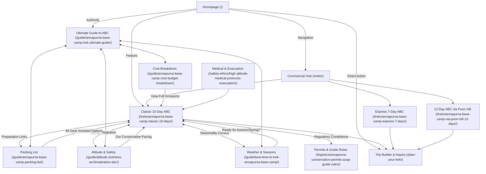

# INFORMATION ARCHITECTURE & SEMANTIC URL FRAMEWORK
## Brand: ABC Trek in Nepal (`abctrekinnepal.com`)
**Document Version:** 1.0 (Pre-Development Information Architecture Baseline)  
**Lead Roles:** Lead Information Architect, SEO Strategist, UX Strategist, Senior Web Product Designer  

---

## 1. SEMANTIC ARCHITECTURE PRINCIPLES & DIRECTORY DESIGN

### 1.1 Philosophy: Clean, Semantic, Shallow URLs vs. Over-Nested Silos
In legacy SEO, websites often created deep directory trees like:  
`abctrekinnepal.com/nepal-trekking/annapurna-region/annapurna-base-camp-trek/preparation/packing/` (5 levels deep, high crawl latency, poor click-through rate, inflexible).

Modern search engines and users benefit from a **topically clustered, shallow URL architecture (maximum 2 to 3 tiers)** where semantic parent-child relationships are reinforced via:
1. Breadcrumbs schema (`BreadcrumbList`).
2. Strict contextual internal linking hubs.
3. Natural Knowledge Graph entity relationships (`isPartOf`, `hasPart`, `about`).

### 1.2 The Core Directory Taxonomy
* `/` — **Brand & Authority Anchor** (Homepage)
* `/treks/` — **Commercial Product Hub** (Money pages & package variations)
* `/destinations/` — **Geographical & Regional Entity Hub** (Topical anchors for Conservation Area & Sanctuary)
* `/guide/` — **Definitive Field Guides** (Top-of-funnel informational hubs & preparation pillars)
* `/logistics/` — **Operational Intelligence** (Travel, permits, transportation, and mountain living reality)
* `/safety-ethics/` — **E-E-A-T & Trust Hub** (Medical protocols, guide/porter welfare charter, ethical stewardship)
* `/company/` — **Institutional & Contact Architecture** (About, guides, terms, booking, direct inquiry)
* `/journal/` — **Scalable Editorial Content Hub** (Trail dispatches, cultural heritage, mountain insights)

---

## 2. MASTER VISUAL SITEMAP & CONTENT HIERARCHY

```
abctrekinnepal.com/ (Homepage: Brand & Specialist Anchor)
│
├── /treks/ (Commercial Overview Hub)
│   ├── /treks/annapurna-base-camp-classic-10-days/ [PRIMARY MONEY PAGE - FLAGSHIP]
│   ├── /treks/annapurna-base-camp-express-7-days/ [COMMERCIAL MONEY PAGE - FAST ROUTE]
│   ├── /treks/annapurna-base-camp-via-poon-hill-12-days/ [COMMERCIAL MONEY PAGE - PANORAMIC]
│   ├── /treks/annapurna-sanctuary-ghandruk-circuit-14-days/ [COMMERCIAL MONEY PAGE - FULL IMMERSION]
│   ├── /treks/private-custom-annapurna-trek/ [COMMERCIAL BESPOKE / GROUP INQUIRY]
│   │
│   └── [Strategic Regional Expansion Corridors]
│       ├── /treks/mardi-himal-trek/ [SECONDARY COMMERCIAL]
│       ├── /treks/poon-hill-sunrise-trek-4-days/ [SECONDARY COMMERCIAL]
│       └── /treks/annapurna-circuit-trek/ [SECONDARY COMMERCIAL]
│
├── /destinations/ (Entity Anchor & Geographical Hub)
│   ├── /destinations/annapurna-conservation-area/ [REGIONAL ENTITY PILLAR]
│   └── /destinations/annapurna-sanctuary/ [BASIN & GEOGRAPHICAL BOWL ENTITY]
│
├── /guide/ (Informational Authority & Preparation Hub)
│   ├── /guide/annapurna-base-camp-trek-ultimate-guide/ [CORE INFORMATIONAL PILLAR]
│   ├── /guide/best-time-to-trek-annapurna-base-camp/ [SEASONALITY & CLIMATE SPOKE]
│   ├── /guide/annapurna-base-camp-packing-list/ [GEAR & PACKING SPOKE]
│   ├── /guide/altitude-sickness-acclimatization-abc/ [HIGH-ALTITUDE SAFETY SPOKE]
│   ├── /guide/abc-trek-difficulty-fitness-training/ [PHYSICAL PREPARATION SPOKE]
│   └── /guide/annapurna-base-camp-cost-budget-breakdown/ [FINANCIAL TRANSPARENCY SPOKE]
│
├── /logistics/ (Operational & Nepal Travel Intelligence)
│   ├── /logistics/pokhara-to-annapurna-base-camp-transportation/ [TRAILHEADS & ACCESS]
│   ├── /logistics/annapurna-conservation-permits-acap-guide-rules/ [REGULATORY & LEGAL]
│   ├── /logistics/teahouses-food-accommodation-annapurna/ [LIVING REALITY & AMENITIES]
│   └── /logistics/kathmandu-to-pokhara-travel-guide/ [DOMESTIC TRANSIT OPTIONS]
│
├── /safety-ethics/ (E-E-A-T & High-Altitude Integrity Hub)
│   ├── /safety-ethics/high-altitude-medical-protocols-evacuation/ [CLINICAL SAFETY PROTOCOLS]
│   ├── /safety-ethics/guide-porter-welfare-charter/ [IPPG COMPLIANCE & ETHICAL WAGES]
│   └── /safety-ethics/responsible-himalayan-travel/ [LEAVE NO TRACE & COMMUNITY IMPACT]
│
├── /company/ (Trust, Verification & Institutional)
│   ├── /company/about-us/ [FOUNDER, SPECIALIST CREED, LOCAL ROOTS]
│   ├── /company/our-guides/ [LICENSED GUIDE PROFILES & CREDENTIALS]
│   ├── /company/reviews-guest-stories/ [AUTHENTIC VERIFIED TESTIMONIALS]
│   ├── /company/pricing-booking-terms-guarantee/ [TERMS, CANCELLATION, REFUNDS]
│   └── /company/contact/ [DIRECT INQUIRY & WHATSAPP CONCIERGE]
│
├── /plan-your-trek/ [INTERACTIVE ROUTE FINDER & CUSTOM INQUIRY CONCIERGE]
│
└── /journal/ (Scalable Editorial Hub)
    ├── /journal/trail-stories/ [DISPATCHES & EXPEDITION NOTES]
    │   └── /journal/trail-stories/what-its-like-to-reach-abc-at-sunrise/
    ├── /journal/culture-heritage/ [GURUNG TRADITIONS & LOCAL LIFE]
    │   └── /journal/culture-heritage/gurung-culture-of-ghandruk-and-chhomrong/
    └── /journal/mountain-insights/ [ALPINISM, PEAKS & GEOLOGY]
        └── /journal/mountain-insights/machhapuchhre-the-sacred-fishtail-mountain/
```

---

## 3. MASTER URL & PAGE-BY-PAGE INFORMATION ARCHITECTURE TABLE

Below is the exhaustive specification for every page across categories **A through J**.

### Category A: Homepage
| Field | Value |
| :--- | :--- |
| **Page Name** | ABC Trek in Nepal — Annapurna Base Camp Specialists |
| **Recommended URL** | `https://abctrekinnepal.com/` |
| **Page Type** | Brand Homepage / Commercial Anchor |
| **Primary Search Intent** | Navigational / Commercial Investigation |
| **Primary Entity** | `ABC Trek in Nepal` (Organization / TravelAgency) |
| **Main Topic** | Premium, safety-led Annapurna Base Camp trekking expeditions |
| **Supporting Entities/Topics** | Annapurna Sanctuary, Pokhara, Licensed Sherpa/Gurung Guides, High-Altitude Safety, IPPG Porter Welfare |
| **Business Purpose** | Establish brand authority, communicate specialized focus, route visitors to signature commercial treks, generate immediate inquiries |
| **Internal Links Out** | $\rightarrow$ `/treks/annapurna-base-camp-classic-10-days/`, `/treks/`, `/guide/annapurna-base-camp-trek-ultimate-guide/`, `/safety-ethics/high-altitude-medical-protocols-evacuation/`, `/company/about-us/`, `/company/contact/`, `/plan-your-trek/` |
| **Internal Links In** | Linked from all pages via logo, primary nav, and footer |
| **Parent Page** | None (Root) |
| **Child Pages** | `/treks/`, `/destinations/`, `/guide/`, `/logistics/`, `/safety-ethics/`, `/company/`, `/journal/` |
| **Indexable?** | Yes |
| **Priority** | High (Phase 1) |

---

### Category B: Primary Commercial Pages (Money Pages)

#### B.1 Flagship 10-Day Classic ABC Trek
| Field | Value |
| :--- | :--- |
| **Page Name** | Annapurna Base Camp Trek – The Classic 10-Day Sanctuary Expedition |
| **Recommended URL** | `/treks/annapurna-base-camp-classic-10-days/` |
| **Page Type** | **Primary Money Page** (Marquee Commercial Flagship) |
| **Primary Search Intent** | Transactional / Commercial Investigation (`book annapurna base camp trek`, `abc trek 10 days`, `annapurna base camp trek package`) |
| **Primary Entity** | `Annapurna Base Camp Trek` (TouristTrip) |
| **Main Topic** | 10-day Pokhara-to-Pokhara Annapurna Sanctuary expedition |
| **Supporting Entities/Topics** | Machhapuchhre Base Camp, Chhomrong, Deurali, ACAP permit, Teahouse accommodation, Trekking cost, Day-by-day itinerary |
| **Business Purpose** | Main revenue generator; convert high-intent commercial searchers into confirmed bookings and bespoke inquiries |
| **Internal Links Out** | $\rightarrow$ `/plan-your-trek/`, `/company/contact/`, `/guide/annapurna-base-camp-packing-list/`, `/guide/altitude-sickness-acclimatization-abc/`, `/logistics/teahouses-food-accommodation-annapurna/`, `/safety-ethics/guide-porter-welfare-charter/` |
| **Internal Links In** | $\leftarrow$ Homepage, `/treks/`, all `/guide/` spokes, `/destinations/annapurna-sanctuary/`, relevant journal articles |
| **Parent Page** | `/treks/` |
| **Child Pages** | None |
| **Indexable?** | Yes |
| **Priority** | High (Phase 1) |

#### B.2 7-Day Express ABC Trek
| Field | Value |
| :--- | :--- |
| **Page Name** | Annapurna Base Camp Express Trek – 7 Days |
| **Recommended URL** | `/treks/annapurna-base-camp-express-7-days/` |
| **Page Type** | Primary Money Page (Time-Constrained / Fast Hiker Target) |
| **Primary Search Intent** | Transactional / Commercial Investigation (`short abc trek`, `annapurna base camp 7 days itinerary`, `fast abc trek pokhara`) |
| **Primary Entity** | `Annapurna Base Camp Trek` |
| **Main Topic** | Accelerated 7-day itinerary utilizing Siwai/Matque trailheads for fit trekkers |
| **Supporting Entities/Topics** | Private 4WD transit, rapid ascent safety, Bamboo, Deurali, Jhinu Danda hot springs |
| **Business Purpose** | Capture time-constrained travelers (10-day holiday window); prevent abandonment to generic express agencies |
| **Internal Links Out** | $\rightarrow$ `/treks/annapurna-base-camp-classic-10-days/` (alternative pacing), `/guide/abc-trek-difficulty-fitness-training/`, `/plan-your-trek/` |
| **Internal Links In** | $\leftarrow$ `/treks/`, Homepage, `/guide/annapurna-base-camp-trek-ultimate-guide/` |
| **Parent Page** | `/treks/` |
| **Child Pages** | None |
| **Indexable?** | Yes |
| **Priority** | High (Phase 1) |

#### B.3 12-Day ABC via Poon Hill & Ghorepani
| Field | Value |
| :--- | :--- |
| **Page Name** | Annapurna Base Camp Trek via Poon Hill – 12 Days |
| **Recommended URL** | `/treks/annapurna-base-camp-via-poon-hill-12-days/` |
| **Page Type** | Primary Money Page (Scenic / Panoramic Combination) |
| **Primary Search Intent** | Commercial Investigation / Transactional (`abc trek via poon hill`, `ghorepani poon hill annapurna base camp 12 days`) |
| **Primary Entity** | `Poon Hill` & `Annapurna Base Camp` |
| **Main Topic** | Combined route: Sunrise over Dhaulagiri/Annapurna from Poon Hill (3,210m) + Annapurna Sanctuary basin |
| **Supporting Entities/Topics** | Ulleri 3,300 stone steps, Ghorepani, Tadapani, rhododendron forests, Chhomrong |
| **Business Purpose** | High-ticket package conversion for scenic photographers and travelers wanting gradual acclimatization |
| **Internal Links Out** | $\rightarrow$ `/treks/poon-hill-sunrise-trek-4-days/` (standalone comparison), `/guide/best-time-to-trek-annapurna-base-camp/`, `/plan-your-trek/` |
| **Internal Links In** | $\leftarrow$ `/treks/`, Homepage, `/guide/annapurna-base-camp-trek-ultimate-guide/`, `/destinations/annapurna-conservation-area/` |
| **Parent Page** | `/treks/` |
| **Child Pages** | None |
| **Indexable?** | Yes |
| **Priority** | High (Phase 1) |

#### B.4 14-Day Annapurna Sanctuary & Ghandruk Circuit
| Field | Value |
| :--- | :--- |
| **Page Name** | Annapurna Sanctuary & Ghandruk Heritage Circuit – 14 Days |
| **Recommended URL** | `/treks/annapurna-sanctuary-ghandruk-circuit-14-days/` |
| **Page Type** | Supporting Commercial Page (Deep Immersion & Gentle Pacing) |
| **Primary Search Intent** | Commercial Investigation (`annapurna sanctuary circuit 14 days`, `ghandruk abc trek`) |
| **Primary Entity** | `Annapurna Sanctuary` & `Ghandruk` |
| **Main Topic** | Comprehensive loop combining ethnic Gurung heritage villages with high-altitude sanctuary basin |
| **Supporting Entities/Topics** | Gurung culture, Landruk, Jhinu Danda hot springs, gentle acclimatization |
| **Business Purpose** | Cater to older travelers, families, or multi-generational groups needing relaxed walking hours |
| **Internal Links Out** | $\rightarrow$ `/journal/culture-heritage/gurung-culture-of-ghandruk-and-chhomrong/`, `/treks/annapurna-base-camp-classic-10-days/`, `/plan-your-trek/` |
| **Internal Links In** | $\leftarrow$ `/treks/`, `/destinations/annapurna-sanctuary/` |
| **Parent Page** | `/treks/` |
| **Child Pages** | None |
| **Indexable?** | Yes |
| **Priority** | Medium (Phase 2) |

#### B.5 Private & Custom Annapurna Expeditions
| Field | Value |
| :--- | :--- |
| **Page Name** | Private & Bespoke Annapurna Base Camp Treks |
| **Recommended URL** | `/treks/private-custom-annapurna-trek/` |
| **Page Type** | Supporting Commercial Page (High-Touch / Bespoke) |
| **Primary Search Intent** | Transactional (`private guide annapurna base camp`, `custom abc trek nepal`, `luxury abc trek`) |
| **Primary Entity** | `ABC Trek in Nepal` (Private Guiding Services) |
| **Main Topic** | Tailor-made itineraries, private guide/porter teams, upgraded private teahouse rooms, flexible dates |
| **Supporting Entities/Topics** | Solo traveler safety, private family departures, custom dietary requirements, VIP Pokhara transfers |
| **Business Purpose** | Maximize average order value (AOV); capture high-net-worth travelers unwilling to join open groups |
| **Internal Links Out** | $\rightarrow$ `/company/contact/`, `/company/our-guides/`, `/safety-ethics/guide-porter-welfare-charter/` |
| **Internal Links In** | $\leftarrow$ All commercial trek pages (as an upgrade option), Homepage header |
| **Parent Page** | `/treks/` |
| **Child Pages** | None |
| **Indexable?** | Yes |
| **Priority** | High (Phase 1) |

---

### Category C: Trekking Destination & Category Pages

#### C.1 Commercial Overview Hub
| Field | Value |
| :--- | :--- |
| **Page Name** | Annapurna Trekking Expeditions – All Routes & Itineraries |
| **Recommended URL** | `/treks/` |
| **Page Type** | Category Hub / Commercial Directory |
| **Primary Search Intent** | Commercial Investigation (`annapurna base camp treks`, `best annapurna treks nepal`) |
| **Primary Entity** | `Annapurna Region` & `ABC Trek in Nepal` |
| **Main Topic** | Portfolio of curated Annapurna Sanctuary routes compared by duration, elevation, and fitness grade |
| **Supporting Entities/Topics** | Route comparison matrix, pacing philosophy, seasonal recommendations |
| **Business Purpose** | Route prospective clients to their optimal package based on time and physical capability |
| **Internal Links Out** | $\rightarrow$ All `/treks/*` money pages, `/guide/annapurna-base-camp-trek-ultimate-guide/`, `/plan-your-trek/` |
| **Internal Links In** | $\leftarrow$ Homepage main navigation, footer, breadcrumbs from all trek pages |
| **Parent Page** | `/` (Homepage) |
| **Child Pages** | All commercial trek packages |
| **Indexable?** | Yes |
| **Priority** | High (Phase 1) |

#### C.2 Annapurna Conservation Area Entity Pillar
| Field | Value |
| :--- | :--- |
| **Page Name** | Annapurna Conservation Area (ACAP) – Regional Guide & Geography |
| **Recommended URL** | `/destinations/annapurna-conservation-area/` |
| **Page Type** | Geographical Entity Hub / Authority Anchor |
| **Primary Search Intent** | Informational (`annapurna conservation area`, `acap nepal geography`, `annapurna mountains`) |
| **Primary Entity** | `Annapurna Conservation Area` (ProtectedArea) |
| **Main Topic** | Geography, biodiversity, conservation status, mountain ranges, and permit administration of ACAP |
| **Supporting Entities/Topics** | Annapurna I, Machhapuchhre, Modi Khola, flora, fauna, NTNC regulations |
| **Business Purpose** | Anchor the brand to the official geographic entity; capture high-level regional search traffic |
| **Internal Links Out** | $\rightarrow$ `/destinations/annapurna-sanctuary/`, `/treks/`, `/logistics/annapurna-conservation-permits-acap-guide-rules/` |
| **Internal Links In** | $\leftarrow$ Homepage, `/guide/*` articles, footer |
| **Parent Page** | `/destinations/` |
| **Child Pages** | `/destinations/annapurna-sanctuary/` |
| **Indexable?** | Yes |
| **Priority** | Medium (Phase 2) |

#### C.3 Annapurna Sanctuary Basin Entity Anchor
| Field | Value |
| :--- | :--- |
| **Page Name** | The Annapurna Sanctuary – The Sacred High-Altitude Glacial Basin |
| **Recommended URL** | `/destinations/annapurna-sanctuary/` |
| **Page Type** | Geographical Entity Page / Micro-Destination |
| **Primary Search Intent** | Informational (`what is annapurna sanctuary`, `annapurna sanctuary basin`, `annapurna base camp amphitheater`) |
| **Primary Entity** | `Annapurna Sanctuary` (Landform) |
| **Main Topic** | The unique geography of the 4,130m oval amphitheater surrounded by a ring of 10 mountain peaks |
| **Supporting Entities/Topics** | Annapurna South, Hiunchuli, Machhapuchhre, sacred spiritual status for Gurung people |
| **Business Purpose** | Cement brand's specialized ownership of the exact physical destination; bridge geography to commercial routes |
| **Internal Links Out** | $\rightarrow$ `/treks/annapurna-base-camp-classic-10-days/`, `/guide/annapurna-base-camp-trek-ultimate-guide/`, `/journal/mountain-insights/machhapuchhre-the-sacred-fishtail-mountain/` |
| **Internal Links In** | $\leftarrow$ `/destinations/annapurna-conservation-area/`, `/treks/annapurna-base-camp-classic-10-days/` |
| **Parent Page** | `/destinations/` |
| **Child Pages** | None |
| **Indexable?** | Yes |
| **Priority** | High (Phase 1) |

---

### Category D: Annapurna Base Camp Trek Supporting Pages (Pillars & Spokes)

#### D.1 The Ultimate Guide to Annapurna Base Camp Trek (Core Informational Pillar)
| Field | Value |
| :--- | :--- |
| **Page Name** | The Ultimate Guide to Annapurna Base Camp Trek (2026 Edition) |
| **Recommended URL** | `/guide/annapurna-base-camp-trek-ultimate-guide/` |
| **Page Type** | **Core Informational Pillar Guide** |
| **Primary Search Intent** | Informational (`annapurna base camp trek guide`, `everything about abc trek`, `how to trek annapurna base camp`) |
| **Primary Entity** | `Annapurna Base Camp Trek` |
| **Main Topic** | Comprehensive 4,000-word encyclopedic guide covering route overview, key facts, maps, planning, and tips |
| **Supporting Entities/Topics** | Altitude, itinerary options, seasonality summary, permit rules, packing summary, accommodation overview |
| **Business Purpose** | High-volume organic acquisition; establish undisputed topical authority; funnel readers into commercial route pages |
| **Internal Links Out** | $\rightarrow$ All `/guide/*` specialized spokes, all `/treks/*` commercial pages, `/logistics/*` pages |
| **Internal Links In** | $\leftarrow$ Homepage, `/treks/annapurna-base-camp-classic-10-days/`, all `/guide/*` spokes (as parent hub) |
| **Parent Page** | `/guide/` |
| **Child Pages** | Specialized spokes D.2, E.1, E.2, E.3, F.1 |
| **Indexable?** | Yes |
| **Priority** | High (Phase 1) |

#### D.2 Seasonality, Weather & Month-by-Month Matrix
| Field | Value |
| :--- | :--- |
| **Page Name** | Best Time to Trek Annapurna Base Camp: Weather & Month-by-Month Guide |
| **Recommended URL** | `/guide/best-time-to-trek-annapurna-base-camp/` |
| **Page Type** | Informational Supporting Spoke |
| **Primary Search Intent** | Informational (`best time to trek annapurna base camp`, `abc trek weather november`, `annapurna base camp in april`) |
| **Primary Entity** | `Annapurna Base Camp Trek` (Weather / Climate) |
| **Main Topic** | Seasonal breakdown: Autumn (Oct–Nov), Spring (Mar–May), Winter (Dec–Feb), Monsoon (Jun–Aug) |
| **Supporting Entities/Topics** | Temperature graphs at ABC (4,130m) vs Pokhara (820m), rainfall, visibility, avalanche risk windows |
| **Business Purpose** | Capture searchers at the earliest stage of planning; drive seasonal bookings for Autumn and Spring |
| **Internal Links Out** | $\rightarrow$ `/treks/annapurna-base-camp-classic-10-days/`, `/guide/annapurna-base-camp-packing-list/`, `/plan-your-trek/` |
| **Internal Links In** | $\leftarrow$ `/guide/annapurna-base-camp-trek-ultimate-guide/`, Homepage, `/treks/*` commercial pages |
| **Parent Page** | `/guide/` |
| **Child Pages** | None |
| **Indexable?** | Yes |
| **Priority** | High (Phase 1) |

---

### Category E: Trek Preparation Pages

#### E.1 Packing List, Gear Breakdown & Rental Guide
| Field | Value |
| :--- | :--- |
| **Page Name** | Annapurna Base Camp Trek Packing List: Gear Checklist & Rental Guide |
| **Recommended URL** | `/guide/annapurna-base-camp-packing-list/` |
| **Page Type** | Informational Supporting Spoke / Preparation Utility |
| **Primary Search Intent** | Informational (`annapurna base camp packing list`, `what to pack for abc trek nepal`, `renting gear in pokhara`) |
| **Primary Entity** | `Trekking Equipment` & `Annapurna Base Camp Trek` |
| **Main Topic** | Layering system, footwear, sleeping bag ratings (-10°C), porter duffel limits (10–12kg per person), gear rental |
| **Supporting Entities/Topics** | Microspikes, trekking poles, water purification, down jackets, electronics in sub-zero temps |
| **Business Purpose** | High-utility page that builds user trust; provides downloadable packing checklist PDF (lead magnet) |
| **Internal Links Out** | $\rightarrow$ `/safety-ethics/guide-porter-welfare-charter/` (weight limit rationale), `/treks/annapurna-base-camp-classic-10-days/` |
| **Internal Links In** | $\leftarrow$ `/guide/annapurna-base-camp-trek-ultimate-guide/`, `/treks/*` commercial itineraries |
| **Parent Page** | `/guide/` |
| **Child Pages** | None |
| **Indexable?** | Yes |
| **Priority** | High (Phase 1) |

#### E.2 Altitude Sickness, Acclimatization & Medical Protocols
| Field | Value |
| :--- | :--- |
| **Page Name** | Altitude Sickness on Annapurna Base Camp Trek: Symptoms, Prevention & Safety |
| **Recommended URL** | `/guide/altitude-sickness-acclimatization-abc/` |
| **Page Type** | Informational Supporting Spoke / High-Altitude Safety |
| **Primary Search Intent** | Informational (`altitude sickness annapurna base camp`, `abc trek elevation profile`, `diamox for abc trek`) |
| **Primary Entity** | `Acute Mountain Sickness (AMS)` & `Annapurna Base Camp` |
| **Main Topic** | Physiological altitude progression from 820m to 4,130m; early symptoms, Lake Louise scoring, Diamox, descent rules |
| **Supporting Entities/Topics** | HAPE, HACE, Deurali to ABC elevation jump, pulse oximeter monitoring, emergency descent |
| **Business Purpose** | Demonstrate medical rigor and E-E-A-T; de-escalate anxiety for first-time trekkers |
| **Internal Links Out** | $\rightarrow$ `/safety-ethics/high-altitude-medical-protocols-evacuation/`, `/treks/annapurna-base-camp-classic-10-days/` |
| **Internal Links In** | $\leftarrow$ All `/treks/*` pages, `/guide/annapurna-base-camp-trek-ultimate-guide/` |
| **Parent Page** | `/guide/` |
| **Child Pages** | None |
| **Indexable?** | Yes |
| **Priority** | High (Phase 1) |

#### E.3 Difficulty, Fitness & Training Blueprint
| Field | Value |
| :--- | :--- |
| **Page Name** | Annapurna Base Camp Trek Difficulty: Can You Do It? (12-Week Training Plan) |
| **Recommended URL** | `/guide/abc-trek-difficulty-fitness-training/` |
| **Page Type** | Informational Supporting Spoke / Physical Readiness |
| **Primary Search Intent** | Informational (`how hard is annapurna base camp trek`, `abc trek difficulty`, `training for abc trek`) |
| **Primary Entity** | `Physical Fitness` & `Annapurna Base Camp Trek` |
| **Main Topic** | Objective trail difficulty assessment: daily walking hours (5–7 hrs), steep stone steps, cardio & leg conditioning |
| **Supporting Entities/Topics** | Ulleri staircase, Chhomrong river valley climbs, knee health, 12-week stair/aerobic training routine |
| **Business Purpose** | Reassure capable travelers who are second-guessing their fitness; route less fit travelers to 12- or 14-day paced routes |
| **Internal Links Out** | $\rightarrow$ `/treks/annapurna-base-camp-via-poon-hill-12-days/`, `/treks/annapurna-base-camp-classic-10-days/` |
| **Internal Links In** | $\leftarrow$ `/guide/annapurna-base-camp-trek-ultimate-guide/`, `/treks/*` commercial pages |
| **Parent Page** | `/guide/` |
| **Child Pages** | None |
| **Indexable?** | Yes |
| **Priority** | High (Phase 1) |

#### E.4 Cost, Budget Breakdown & Incidentals Guide
| Field | Value |
| :--- | :--- |
| **Page Name** | Annapurna Base Camp Trek Cost: Complete Budget & Incidental Expenses Guide |
| **Recommended URL** | `/guide/annapurna-base-camp-cost-budget-breakdown/` |
| **Page Type** | Informational Supporting Spoke / Financial Transparency |
| **Primary Search Intent** | Commercial Investigation / Informational (`annapurna base camp trek cost`, `how much does abc trek cost`, `abc trek daily budget`) |
| **Primary Entity** | `Travel Costs` & `Annapurna Base Camp Trek` |
| **Main Topic** | Comprehensive price transparency: package rates vs independent breakdown; on-trail cash needs (charging, Wi-Fi, hot showers) |
| **Supporting Entities/Topics** | ACAP permit fee, guide/porter daily wages, tipping guidelines, ATM realities in Pokhara vs trail |
| **Business Purpose** | High-intent pre-booking validation; prove that our package offers superior value and zero hidden charges |
| **Internal Links Out** | $\rightarrow$ `/treks/annapurna-base-camp-classic-10-days/`, `/company/pricing-booking-terms-guarantee/` |
| **Internal Links In** | $\leftarrow$ `/guide/annapurna-base-camp-trek-ultimate-guide/`, `/treks/*` pages |
| **Parent Page** | `/guide/` |
| **Child Pages** | None |
| **Indexable?** | Yes |
| **Priority** | High (Phase 1) |

---

### Category F: Nepal Travel & Logistics Pages

#### F.1 Trailhead Access & Pokhara to ABC Transportation
| Field | Value |
| :--- | :--- |
| **Page Name** | How to Get to Annapurna Base Camp: Pokhara to Trailheads Transportation Guide |
| **Recommended URL** | `/logistics/pokhara-to-annapurna-base-camp-transportation/` |
| **Page Type** | Logistics Supporting Guide |
| **Primary Search Intent** | Informational / Logistics (`pokhara to annapurna base camp`, `how to reach abc trek trailhead`, `siwai jeep pokhara`) |
| **Primary Entity** | `Pokhara` & `Annapurna Trailheads` |
| **Main Topic** | Transportation logistics: Pokhara to Nayapul, Birethanti, Siwai/Matque, and Ghandruk via private jeep vs local bus |
| **Supporting Entities/Topics** | Road conditions, transit durations, trailhead elevations, returning from Jhinu Danda |
| **Business Purpose** | Solves major travel logistics headaches; highlights that our packages include private jeep transport |
| **Internal Links Out** | $\rightarrow$ `/treks/annapurna-base-camp-express-7-days/`, `/treks/annapurna-base-camp-classic-10-days/` |
| **Internal Links In** | $\leftarrow$ `/guide/annapurna-base-camp-trek-ultimate-guide/`, `/logistics/kathmandu-to-pokhara-travel-guide/` |
| **Parent Page** | `/logistics/` |
| **Child Pages** | None |
| **Indexable?** | Yes |
| **Priority** | Medium (Phase 2) |

#### F.2 2026 ACAP Permits & Mandatory Guide Regulations
| Field | Value |
| :--- | :--- |
| **Page Name** | Annapurna Trekking Permits & Guide Regulations (2026 Update) |
| **Recommended URL** | `/logistics/annapurna-conservation-permits-acap-guide-rules/` |
| **Page Type** | Regulatory & Legal Authority Guide |
| **Primary Search Intent** | Informational (`annapurna base camp trek permit`, `do i need a guide for abc trek 2026`, `acap permit cost pokhara`) |
| **Primary Entity** | `Annapurna Conservation Area Permit (ACAP)` |
| **Main Topic** | Official legal requirements: ACAP fees (NPR 3,000), TIMS status update, mandatory licensed guide regulations, NTNC offices |
| **Supporting Entities/Topics** | Passport photo requirements, checkpoint inspection locations (Birethanti, Chhomrong), fines |
| **Business Purpose** | Ultimate trust-builder; positions our company as a strictly compliant, government-registered operator |
| **Internal Links Out** | $\rightarrow$ `/treks/annapurna-base-camp-classic-10-days/`, `/company/our-guides/` |
| **Internal Links In** | $\leftarrow$ `/guide/annapurna-base-camp-trek-ultimate-guide/`, `/safety-ethics/guide-porter-welfare-charter/` |
| **Parent Page** | `/logistics/` |
| **Child Pages** | None |
| **Indexable?** | Yes |
| **Priority** | High (Phase 1) |

#### F.3 Teahouse Living, Food & Accommodation Realities
| Field | Value |
| :--- | :--- |
| **Page Name** | Teahouse Life on Annapurna Base Camp Trek: Rooms, Food, Wi-Fi & Showers |
| **Recommended URL** | `/logistics/teahouses-food-accommodation-annapurna/` |
| **Page Type** | Logistics Supporting Guide / Experience Transparency |
| **Primary Search Intent** | Informational (`annapurna base camp accommodation`, `teahouse food abc trek`, `charging phone abc trek`) |
| **Primary Entity** | `Teahouse Lodge` & `Annapurna Region` |
| **Main Topic** | Authentic mountain lodge realities: twin bedrooms, communal heated dining rooms, Dal Bhat power, hot shower fees |
| **Supporting Entities/Topics** | Solar electricity, Ncell/Namaste mobile signal, NOLS sanitary standards, boiled drinking water stations |
| **Business Purpose** | Eliminate on-trail culture shock; differentiate our curated teahouse selections from bottom-tier lodges |
| **Internal Links Out** | $\rightarrow$ `/guide/annapurna-base-camp-packing-list/`, `/treks/annapurna-base-camp-classic-10-days/` |
| **Internal Links In** | $\leftarrow$ `/guide/annapurna-base-camp-trek-ultimate-guide/`, `/treks/*` commercial pages |
| **Parent Page** | `/logistics/` |
| **Child Pages** | None |
| **Indexable?** | Yes |
| **Priority** | High (Phase 1) |

#### F.4 Kathmandu to Pokhara Domestic Travel Guide
| Field | Value |
| :--- | :--- |
| **Page Name** | How to Travel from Kathmandu to Pokhara: Flights, Tourist Bus & Private Car |
| **Recommended URL** | `/logistics/kathmandu-to-pokhara-travel-guide/` |
| **Page Type** | Nepal Travel Logistics Guide |
| **Primary Search Intent** | Informational (`kathmandu to pokhara flight vs bus`, `travel to pokhara nepal`, `tourist bus kathmandu pokhara`) |
| **Primary Entity** | `Kathmandu` & `Pokhara` |
| **Main Topic** | Seamless transit guide between international arrival in KTM and the Annapurna gateway city of Pokhara |
| **Supporting Entities/Topics** | 25-minute scenic mountain flights vs Prithvi Highway tourist bus; luggage allowances; road construction status |
| **Business Purpose** | High utility for all international arrivals; offers flight booking add-ons during checkout |
| **Internal Links Out** | $\rightarrow$ `/logistics/pokhara-to-annapurna-base-camp-transportation/`, `/treks/` |
| **Internal Links In** | $\leftarrow$ `/guide/annapurna-base-camp-trek-ultimate-guide/`, `/company/contact/` |
| **Parent Page** | `/logistics/` |
| **Child Pages** | None |
| **Indexable?** | Yes |
| **Priority** | Medium (Phase 2) |

---

### Category G: About & Trust Pages (E-E-A-T Anchors)

#### G.1 Company About Us & Alpine Specialist Creed
| Field | Value |
| :--- | :--- |
| **Page Name** | About ABC Trek in Nepal: Dedicated Annapurna Base Camp Specialists |
| **Recommended URL** | `/company/about-us/` |
| **Page Type** | Brand Trust / E-E-A-T Anchor |
| **Primary Search Intent** | Navigational / Trust Validation (`about abc trek in nepal`, `who is abctrekinnepal`) |
| **Primary Entity** | `ABC Trek in Nepal` |
| **Main Topic** | Company founding philosophy, why we focus exclusively on Annapurna, local Sherpa/Gurung roots, safety standards |
| **Supporting Entities/Topics** | Local community investment, mountain leadership, environmental ethics |
| **Business Purpose** | Validate business legitimacy, eliminate fear of overseas booking scams, convert hesitant evaluators |
| **Internal Links Out** | $\rightarrow$ `/company/our-guides/`, `/safety-ethics/guide-porter-welfare-charter/`, `/treks/` |
| **Internal Links In** | $\leftarrow$ Homepage, header navigation, footer on all pages |
| **Parent Page** | `/company/` |
| **Child Pages** | None |
| **Indexable?** | Yes |
| **Priority** | High (Phase 1) |

#### G.2 High-Altitude Safety & Emergency Evacuation Protocol
| Field | Value |
| :--- | :--- |
| **Page Name** | High-Altitude Safety, Medical Kits & Helicopter Evacuation Protocols |
| **Recommended URL** | `/safety-ethics/high-altitude-medical-protocols-evacuation/` |
| **Page Type** | Safety Authority / E-E-A-T Pillar |
| **Primary Search Intent** | Informational / Trust (`abc trek helicopter rescue`, `annapurna trek safety protocol`, `emergency medical nepal trek`) |
| **Primary Entity** | `Mountain Rescue` & `Wilderness Medicine` |
| **Main Topic** | Concrete emergency response: satellite SOS, pulse oximetry monitoring, rapid altitude descent, helicopter evacuation |
| **Supporting Entities/Topics** | Travel insurance policy requirements (up to 4,500m), Machhapuchhre/Chhomrong helipad points |
| **Business Purpose** | Differentiate from amateur budget operators; reassure solo travelers, parents, and safety-conscious clients |
| **Internal Links Out** | $\rightarrow$ `/company/our-guides/`, `/treks/annapurna-base-camp-classic-10-days/`, `/company/contact/` |
| **Internal Links In** | $\leftarrow$ Homepage, all `/treks/*` commercial itineraries, `/guide/altitude-sickness-acclimatization-abc/` |
| **Parent Page** | `/safety-ethics/` |
| **Child Pages** | None |
| **Indexable?** | Yes |
| **Priority** | High (Phase 1) |

#### G.3 Guide & Porter Welfare Charter
| Field | Value |
| :--- | :--- |
| **Page Name** | Our Ethical Commitment: Guide & Porter Welfare Charter (IPPG Standard) |
| **Recommended URL** | `/safety-ethics/guide-porter-welfare-charter/` |
| **Page Type** | Ethics & Corporate Responsibility Anchor |
| **Primary Search Intent** | Informational / Trust (`ethical trekking nepal porter welfare`, `porter rights annapurna`, `fair wage trekking agency nepal`) |
| **Primary Entity** | `Porter (Carrier)` & `International Porter Protection Group (IPPG)` |
| **Main Topic** | Uncompromising porter standards: 20kg weight limit per porter, warm clothing/footwear, full medical/rescue insurance, fair wages |
| **Supporting Entities/Topics** | Guide licensing (NMA/TAAN), tipping culture, equitable community tourism |
| **Business Purpose** | Attract conscientious European, American, and Australasian travelers who actively boycott exploitative agencies |
| **Internal Links Out** | $\rightarrow$ `/treks/`, `/company/about-us/`, `/company/our-guides/` |
| **Internal Links In** | $\leftarrow$ Homepage trust strip, `/guide/annapurna-base-camp-packing-list/`, footer |
| **Parent Page** | `/safety-ethics/` |
| **Child Pages** | None |
| **Indexable?** | Yes |
| **Priority** | High (Phase 1) |

#### G.4 Our Licensed Mountain Guides
| Field | Value |
| :--- | :--- |
| **Page Name** | Meet Our Guides: Licensed Annapurna Himalayan Mountain Leaders |
| **Recommended URL** | `/company/our-guides/` |
| **Page Type** | Team Credentialing / E-E-A-T |
| **Primary Search Intent** | Navigational / Trust (`annapurna base camp guides`, `licensed guide abctrekinnepal`) |
| **Primary Entity** | `Licensed Trekking Guide` |
| **Main Topic** | Verified guide roster: portraits, licensing numbers, wilderness first-aid certifications, years in the Annapurna Sanctuary |
| **Supporting Entities/Topics** | English fluency, language skills, high-altitude summits, cultural interpretation |
| **Business Purpose** | Put genuine human faces behind the brand; humanize the company; substantiate E-E-A-T signals |
| **Internal Links Out** | $\rightarrow$ `/treks/annapurna-base-camp-classic-10-days/`, `/company/contact/` |
| **Internal Links In** | $\leftarrow$ `/company/about-us/`, `/safety-ethics/high-altitude-medical-protocols-evacuation/` |
| **Parent Page** | `/company/` |
| **Child Pages** | None |
| **Indexable?** | Yes |
| **Priority** | Medium (Phase 2 - requires verified staff confirmation) |

#### G.5 Verified Client Reviews & Guest Stories
| Field | Value |
| :--- | :--- |
| **Page Name** | Trekker Stories & Verified Reviews: Experiences in the Annapurna Sanctuary |
| **Recommended URL** | `/company/reviews-guest-stories/` |
| **Page Type** | Social Proof & Review Hub |
| **Primary Search Intent** | Commercial Investigation (`abc trek in nepal reviews`, `annapurna base camp trek experience stories`) |
| **Primary Entity** | `Review` & `ABC Trek in Nepal` |
| **Main Topic** | Authentic customer testimonials, unedited trekker quotes, embeds/links to verified external review profiles |
| **Supporting Entities/Topics** | Solo trekker experiences, couple treks, weather anecdotes, guide commendations |
| **Business Purpose** | Overcome final booking friction; direct proof of service quality |
| **Internal Links Out** | $\rightarrow$ `/treks/annapurna-base-camp-classic-10-days/`, `/plan-your-trek/` |
| **Internal Links In** | $\leftarrow$ Homepage review section, all commercial trek pages |
| **Parent Page** | `/company/` |
| **Child Pages** | None |
| **Indexable?** | Yes |
| **Priority** | High (Phase 1 structure; live reviews populated upon verification) |

#### G.6 Pricing, Booking Terms & Flexible Cancellation
| Field | Value |
| :--- | :--- |
| **Page Name** | Booking Terms, Cancellation Policy & Price Guarantee |
| **Recommended URL** | `/company/pricing-booking-terms-guarantee/` |
| **Page Type** | Legal & Commercial Trust Policy |
| **Primary Search Intent** | Commercial Investigation (`abc trek booking cancellation policy`, `deposit refund terms nepal trek`) |
| **Primary Entity** | `Terms of Service` & `Commercial Guarantee` |
| **Main Topic** | Transparent deposit requirements (e.g. 20%), free date rescheduling up to 30 days prior, emergency postponement terms |
| **Supporting Entities/Topics** | Payment methods (credit card, bank wire), currency exchange, force majeure (weather/landslides) |
| **Business Purpose** | Eliminate financial hesitation; reassure travelers worried about international flight cancellations or sickness |
| **Internal Links Out** | $\rightarrow$ `/company/contact/`, `/treks/` |
| **Internal Links In** | $\leftarrow$ Commercial trek booking drawers, footer |
| **Parent Page** | `/company/` |
| **Child Pages** | None |
| **Indexable?** | Yes |
| **Priority** | High (Phase 1) |

---

### Category H: Contact, Inquiry & Conversion Pages

#### H.1 Contact & Operations Dispatch
| Field | Value |
| :--- | :--- |
| **Page Name** | Contact Our Mountain Operations Team – Pokhara & Kathmandu |
| **Recommended URL** | `/company/contact/` |
| **Page Type** | **Primary Conversion Page** |
| **Primary Search Intent** | Navigational / Transactional (`contact abc trek in nepal`, `annapurna trekking agency pokhara contact`) |
| **Primary Entity** | `ContactPoint` & `ABC Trek in Nepal` |
| **Main Topic** | Direct inquiry channels: responsive contact form, verified Pokhara/Kathmandu office addresses, WhatsApp direct link |
| **Supporting Entities/Topics** | Operating hours (Nepal Standard Time), emergency phone numbers, inquiry response time guarantee (within 12 hrs) |
| **Business Purpose** | Primary capture mechanism for incoming leads, custom requests, and partnership inquiries |
| **Internal Links Out** | $\rightarrow$ `/treks/`, `/company/pricing-booking-terms-guarantee/` |
| **Internal Links In** | $\leftarrow$ Header navigation "Inquire" button, footer, all commercial pages |
| **Parent Page** | `/company/` |
| **Child Pages** | None |
| **Indexable?** | Yes |
| **Priority** | High (Phase 1) |

#### H.2 Interactive Trip Builder & Date Concierge
| Field | Value |
| :--- | :--- |
| **Page Name** | Plan Your Annapurna Trek: Custom Itinerary & Date Selector |
| **Recommended URL** | `/plan-your-trek/` |
| **Page Type** | Interactive Lead Generation / High-Intent UX Tool |
| **Primary Search Intent** | Transactional / Commercial Investigation (`customize annapurna trek`, `plan abc trek`) |
| **Primary Entity** | `TravelAction` & `ABC Trek in Nepal` |
| **Main Topic** | 3-step interactive inquiry: Route selection $\rightarrow$ Season/Dates $\rightarrow$ Group size & preferences |
| **Supporting Entities/Topics** | Private guide requests, hotel upgrade in Pokhara, airport transfer options |
| **Business Purpose** | Significantly higher conversion rate than a generic contact form; gathers pre-qualified client parameters |
| **Internal Links Out** | $\rightarrow$ `/treks/annapurna-base-camp-classic-10-days/`, `/company/contact/` |
| **Internal Links In** | $\leftarrow$ Sticky buttons across all commercial and guide pages |
| **Parent Page** | `/` (Homepage) |
| **Child Pages** | None |
| **Indexable?** | Yes (NoIndex if dynamic parameterized parameters appear, but main landing page is indexable) |
| **Priority** | High (Phase 1) |

---

### Category I: Blog & Content Hub

#### I.1 Editorial Hub (The Annapurna Journal)
| Field | Value |
| :--- | :--- |
| **Page Name** | The Annapurna Journal: Himalayan Stories, Culture & Trail Intelligence |
| **Recommended URL** | `/journal/` |
| **Page Type** | Blog / Editorial Hub |
| **Primary Search Intent** | Informational / Navigational |
| **Primary Entity** | `Blog` & `Annapurna Region` |
| **Main Topic** | Curated editorial articles across 3 core themes: Trail Stories, Culture & Heritage, and Mountain Insights |
| **Supporting Entities/Topics** | Himalayan folklore, mountain flora/fauna, conservation news, photo essays |
| **Business Purpose** | Establish fresh topical content signals for Google; provide long-tail information gain; nurture social media audiences |
| **Internal Links Out** | $\rightarrow$ All `/journal/*` category hubs and articles, `/guide/annapurna-base-camp-trek-ultimate-guide/` |
| **Internal Links In** | $\leftarrow$ Homepage, footer |
| **Parent Page** | `/` (Homepage) |
| **Child Pages** | `/journal/trail-stories/`, `/journal/culture-heritage/`, `/journal/mountain-insights/` |
| **Indexable?** | Yes |
| **Priority** | Medium (Phase 2) |

#### I.2 Journal Category 1: Trail Stories & Dispatches
| Field | Value |
| :--- | :--- |
| **Page Name** | Trail Stories & Expedition Dispatches |
| **Recommended URL** | `/journal/trail-stories/` |
| **Page Type** | Blog Category Hub |
| **Primary Search Intent** | Informational (`annapurna base camp trek experience`, `stories from abc trek`) |
| **Primary Entity** | `HikingTrail` & `Narrative` |
| **Main Topic** | Real firsthand accounts, seasonal trail condition reports, guide journals from the Annapurna Sanctuary |
| **Business Purpose** | Emotional engagement; shows prospective clients the sensory experience of standing at 4,130m |
| **Parent Page** | `/journal/` |
| **Indexable?** | Yes |
| **Priority** | Medium (Phase 2) |

#### I.3 Journal Category 2: Himalayan Culture & Heritage
| Field | Value |
| :--- | :--- |
| **Page Name** | Himalayan Culture, Gurung Heritage & Village Life |
| **Recommended URL** | `/journal/culture-heritage/` |
| **Page Type** | Blog Category Hub |
| **Primary Search Intent** | Informational (`gurung culture nepal`, `ghandruk village tradition`, `culture along abc trek`) |
| **Primary Entity** | `Gurung People` & `CulturalHeritage` |
| **Main Topic** | Traditions, Buddhist/animist beliefs, Gurkha history, architecture, and festivals of villages on the ABC trail |
| **Business Purpose** | Cultural depth and E-E-A-T; satisfies Google’s entity depth requirements for cultural tourism |
| **Parent Page** | `/journal/` |
| **Indexable?** | Yes |
| **Priority** | Medium (Phase 2) |

#### I.4 Journal Category 3: Mountain Insights & Alpinism
| Field | Value |
| :--- | :--- |
| **Page Name** | Mountain Insights: Peaks, Geology & Himalayan Glaciers |
| **Recommended URL** | `/journal/mountain-insights/` |
| **Page Type** | Blog Category Hub |
| **Primary Search Intent** | Informational (`peaks seen from annapurna base camp`, `geology of annapurna sanctuary`) |
| **Primary Entity** | `Annapurna Massif` & `Mountain` |
| **Main Topic** | Mountain profiles of Annapurna I, Machhapuchhre, Hiunchuli; glacier retreat; sanctuary geography |
| **Business Purpose** | Captures geography and alpine enthusiasts; builds dense entity links to Himalayan mountain nodes |
| **Parent Page** | `/journal/` |
| **Indexable?** | Yes |
| **Priority** | Medium (Phase 2) |

---

### Category J: Individual Blog Articles (High-Value Launch Topics)

#### J.1 What It’s Really Like to Reach Annapurna Base Camp at Sunrise
| Field | Value |
| :--- | :--- |
| **Page Name** | What It’s Really Like to Reach Annapurna Base Camp at Dawn |
| **Recommended URL** | `/journal/trail-stories/what-its-like-to-reach-abc-at-sunrise/` |
| **Page Type** | Blog Article (Experiential Narrative) |
| **Primary Search Intent** | Informational (`sunrise at annapurna base camp`, `arriving at abc base camp`) |
| **Primary Entity** | `Annapurna Base Camp` |
| **Main Topic** | Sensory walkthrough of the final morning walk from MBC to ABC: temperatures, light hitting Annapurna I, emotional payoff |
| **Business Purpose** | Top-of-funnel emotional conversion; inspires hesitating researchers to take action |
| **Internal Links Out** | $\rightarrow$ `/treks/annapurna-base-camp-classic-10-days/`, `/guide/best-time-to-trek-annapurna-base-camp/` |
| **Internal Links In** | $\leftarrow$ `/journal/trail-stories/`, `/destinations/annapurna-sanctuary/` |
| **Parent Page** | `/journal/trail-stories/` |
| **Indexable?** | Yes |
| **Priority** | Medium (Phase 2) |

#### J.2 Gurung Culture of Ghandruk and Chhomrong: Guardians of the Sanctuary
| Field | Value |
| :--- | :--- |
| **Page Name** | The Gurung People of Chhomrong and Ghandruk: Heritage, Hospitality & History |
| **Recommended URL** | `/journal/culture-heritage/gurung-culture-of-ghandruk-and-chhomrong/` |
| **Page Type** | Blog Article (Cultural Deep Dive) |
| **Primary Search Intent** | Informational (`gurung people chhomrong`, `ghandruk village culture`) |
| **Primary Entity** | `Gurung People` & `Chhomrong` |
| **Main Topic** | Traditional stone architecture, Gurkha warrior heritage, honey hunting traditions, and hospitality in the Modi River canyon |
| **Business Purpose** | Semantic enrichment; proves deep local connection to the mountain communities |
| **Internal Links Out** | $\rightarrow$ `/treks/annapurna-sanctuary-ghandruk-circuit-14-days/`, `/company/about-us/` |
| **Internal Links In** | $\leftarrow$ `/journal/culture-heritage/`, `/destinations/annapurna-conservation-area/` |
| **Parent Page** | `/journal/culture-heritage/` |
| **Indexable?** | Yes |
| **Priority** | Medium (Phase 2) |

#### J.3 Machhapuchhre: Why the Sacred Fishtail Peak Remains Unclimbed
| Field | Value |
| :--- | :--- |
| **Page Name** | Machhapuchhre (Fishtail Mountain): The Sacred Peak No One Can Climb |
| **Recommended URL** | `/journal/mountain-insights/machhapuchhre-the-sacred-fishtail-mountain/` |
| **Page Type** | Blog Article (Mountain Lore & Alpinism) |
| **Primary Search Intent** | Informational (`why is machhapuchhre unclimbed`, `fishtail mountain history nepal`, `machhapuchhre elevation`) |
| **Primary Entity** | `Machhapuchhre` (Mountain) |
| **Main Topic** | Why the Nepal government banned summit attempts on Machhapuchhre (6,993m); spiritual association with Lord Shiva; 1957 British expedition |
| **Business Purpose** | Viral / highly shared informational content; attracts worldwide mountain enthusiasts; links to Machhapuchhre Base Camp route info |
| **Internal Links Out** | $\rightarrow$ `/treks/annapurna-base-camp-classic-10-days/`, `/destinations/annapurna-sanctuary/` |
| **Internal Links In** | $\leftarrow$ `/journal/mountain-insights/`, `/destinations/annapurna-sanctuary/` |
| **Parent Page** | `/journal/mountain-insights/` |
| **Indexable?** | Yes |
| **Priority** | Medium (Phase 2) |

---

## 4. COMMERCIAL ARCHITECTURE & REVENUE HIERARCHY

To prevent commercial dilution, pages are strictly segmented into 4 revenue tiers:

```
┌─────────────────────────────────────────────────────────────────────────────┐
│ TIER 1: PRIMARY MONEY PAGES (Generate 80%+ of Inquiries & Bookings)         │
│ - /treks/annapurna-base-camp-classic-10-days/ (Core flagship product)      │
│ - /treks/annapurna-base-camp-express-7-days/ (High-converting fast route)   │
│ - /treks/annapurna-base-camp-via-poon-hill-12-days/ (High-ticket package)   │
│ - /treks/private-custom-annapurna-trek/ (High-AOV bespoke private groups)   │
│ ACTION: Prominently featured in main navigation, hero CTAs, and mobile bars. │
├─────────────────────────────────────────────────────────────────────────────┤
│ TIER 2: SUPPORTING COMMERCIAL & EXPANSION PAGES                             │
│ - /treks/annapurna-sanctuary-ghandruk-circuit-14-days/                      │
│ - /treks/mardi-himal-trek/ (Future regional expansion)                      │
│ - /treks/poon-hill-sunrise-trek-4-days/ (Future introductory expansion)     │
│ ACTION: Listed under secondary tabs in the /treks/ hub.                     │
├─────────────────────────────────────────────────────────────────────────────┤
│ TIER 3: CONVERSION & TRANSACTION ENGINE                                     │
│ - /plan-your-trek/ (Interactive 3-step route builder)                       │
│ - /company/contact/ (Direct dispatch & verified phone/WhatsApp links)       │
│ ACTION: Persistent across every single page via sticky triggers.            │
├─────────────────────────────────────────────────────────────────────────────┤
│ TIER 4: INFORMATIONAL REVENUE-FEEDERS (Top-of-Funnel Traffic Collectors)   │
│ - /guide/annapurna-base-camp-trek-ultimate-guide/                           │
│ - /guide/best-time-to-trek-annapurna-base-camp/                             │
│ - /guide/annapurna-base-camp-cost-budget-breakdown/                         │
│ ACTION: Embedded with high-contrast commercial CTA blocks driving to Tier 1.│
└─────────────────────────────────────────────────────────────────────────────┘
```

---

## 5. CONTEXTUAL INTERNAL LINKING GRAPH

A structured internal linking strategy ensures PageRank flows directly from high-volume informational guides into primary money pages, while search engines discover clear thematic clusters.



### Contextual Anchor Text Rules:
* **Never use:** "Click here", "Read more", "Book now" in informational hyperlinks.
* **Always use entity-rich, natural phrases:**
  * To Classic Route: *"review our complete 10-day Annapurna Sanctuary itinerary"*
  * To Weather Spoke: *"verify the seasonal temperature profile of Annapurna Base Camp"*
  * To Packing Spoke: *"check our complete Annapurna trekking gear checklist"*
  * To Medical Safety: *"read our high-altitude medical protocol and evacuation standards"*

---

## 6. CRITICAL SEO RISK MITIGATION & ARCHITECTURAL AUDIT

### 6.1 Orphan-Page Risks & Structural Safeguards
* **The Risk:** In-depth guide spokes (e.g. `/guide/abc-trek-difficulty-fitness-training/`) or specific journal entries risk becoming orphans (isolated with few or no incoming internal links) if only linked from a distant blog feed.
* **Structural Safeguards:**
  1. **Automated Breadcrumb Navigation:** Every sub-page must carry structured HTML breadcrumbs linking back to its section hub and home.
  2. **Reciprocal Pillar Integration:** The core pillar (`/guide/annapurna-base-camp-trek-ultimate-guide/`) contains a permanent visual directory linking directly to all 6 educational spokes.
  3. **Site-Wide Utility Mega-Footer:** Grouped links categorized into *Signature Treks*, *Trekker Resources*, *Safety & Ethics*, and *Company*.

### 6.2 Keyword Cannibalization Risks & Disambiguation Matrix
The most dangerous trap in adventure travel SEO is confusing **Commercial Intent** (`/treks/...`) with **Informational Intent** (`/guide/...`).

| Potential Conflict Pair | Conflicting Query | How We Disambiguate Architecture |
| :--- | :--- | :--- |
| 1. `/treks/annapurna-base-camp-classic-10-days/` vs. `/guide/annapurna-base-camp-trek-ultimate-guide/` | "Annapurna Base Camp Trek" | **Commercial Page:** Targeted at *transactional* intent (`book`, `tour`, `price`, `dates`, `package`). Emphasizes price, day-by-day logistics, inclusions, and inquiry buttons.<br>**Guide Page:** Targeted at *informational* intent (`guide`, `how to`, `what to expect`, `elevation`, `history`). Emphasizes broad educational knowledge and links to the commercial page for execution. |
| 2. `/guide/annapurna-base-camp-cost-budget-breakdown/` vs. `/company/pricing-booking-terms-guarantee/` | "Annapurna Base Camp Trek cost" | **Cost Guide:** Explains *on-trail expenses*, teahouse incidentals (shower/Wi-Fi costs), permit fees, and tipping culture.<br>**Pricing Terms:** Explains *agency payment logistics*, deposit percentages, wire instructions, refund policies, and trip postponement terms. |
| 3. `/logistics/annapurna-conservation-permits-acap-guide-rules/` vs. `/safety-ethics/guide-porter-welfare-charter/` | "Nepal trekking guide rules" | **Permits Page:** Addresses the *legal / government regulations* for foreign tourists (NTB rules, ACAP checkpoint penalties).<br>**Welfare Charter:** Addresses our *internal ethical labor standards* (porter load limits, insurance, living wages). |

### 6.3 Duplicate-Intent Risks & Pages That Must NOT Be Created
To prevent thin content, Google spam penalties, and topical dilution, the following pages **must never be created**:

1. **DO NOT CREATE: Individual Village Pages as Thin SEO Stubs**
   * *Example Bad Pages:* `/destinations/chhomrong/`, `/destinations/dovan/`, `/destinations/deurali/`, `/destinations/bamboo/`.
   * *Reason:* Creating 20 thin pages with 200 words of copied text about tiny teahouse stops creates programmatic SEO spam.
   * *Solution:* Consolidate all village waypoint intelligence into the **Day-by-Day Itinerary Accordions** on commercial pages and into the **Teahouse Living Guide**.
2. **DO NOT CREATE: Artificial Keyword-Variant Itinerary Pages**
   * *Example Bad Pages:* `/treks/annapurna-base-camp-trek-8-days/`, `/treks/annapurna-base-camp-trek-9-days/`, `/treks/annapurna-base-camp-trek-11-days/`.
   * *Reason:* Splitting standard routes into every possible day permutation fragments ranking power and creates duplicate content.
   * *Solution:* Offer the **10-Day Classic** and **7-Day Express** as core indexable pages; handle 8-, 9-, or 11-day variations dynamically via the **Custom Itinerary Tool** (`/plan-your-trek/`).
3. **DO NOT CREATE: Separate Month-by-Month SEO Spinoffs**
   * *Example Bad Pages:* `/annapurna-trek-in-october/`, `/annapurna-trek-in-november/`, `/annapurna-trek-in-april/`.
   * *Reason:* Results in 12 nearly identical, thin, duplicate pages.
   * *Solution:* Consolidate all 12 months into one authoritative, data-dense, interactive guide: `/guide/best-time-to-trek-annapurna-base-camp/`.
4. **DO NOT CREATE: City-Targeted Doorway Pages**
   * *Example Bad Pages:* `/annapurna-trek-for-singaporeans/`, `/annapurna-trek-from-sydney/`, `/annapurna-trek-from-london/`.
   * *Reason:* Classic Google Helpful Content violation (doorway pages with duplicate content).

---

## 7. RECOMMENDED ROLLOUT PHASING & PRIORITY

```
┌─────────────────────────────────────────────────────────────────────────────┐
│ PHASE 1: CORE COMMERCIAL & FOUNDATIONAL TRUST ENGINE (Immediate Build)      │
│ [High Priority - 14 Essential Pages]                                       │
│ 1. Homepage: /                                                              │
│ 2. Commercial Hub: /treks/                                                  │
│ 3. Flagship Money Page: /treks/annapurna-base-camp-classic-10-days/         │
│ 4. Fast Money Page: /treks/annapurna-base-camp-express-7-days/              │
│ 5. Panoramic Money Page: /treks/annapurna-base-camp-via-poon-hill-12-days/  │
│ 6. Bespoke Money Page: /treks/private-custom-annapurna-trek/                │
│ 7. Destination Anchor: /destinations/annapurna-sanctuary/                   │
│ 8. Core Informational Pillar: /guide/annapurna-base-camp-trek-ultimate-guide│
│ 9. High-Intent Spoke: /guide/best-time-to-trek-annapurna-base-camp/         │
│ 10. High-Intent Spoke: /guide/annapurna-base-camp-packing-list/             │
│ 11. High-Intent Spoke: /guide/altitude-sickness-acclimatization-abc/        │
│ 12. Regulatory Guide: /logistics/annapurna-conservation-permits-acap-rules/ │
│ 13. High-Altitude Safety E-E-A-T: /safety-ethics/high-altitude-medical/     │
│ 14. Primary Conversion Engine: /company/contact/ & /plan-your-trek/         │
├─────────────────────────────────────────────────────────────────────────────┤
│ PHASE 2: TOPICAL DEPTH, LOGISTICS & EDITORIAL EXPANSION                     │
│ [Medium Priority - 10 Pages]                                                │
│ 1. 14-Day Circuit: /treks/annapurna-sanctuary-ghandruk-circuit-14-days/     │
│ 2. Regional Entity: /destinations/annapurna-conservation-area/              │
│ 3. Spoke: /guide/abc-trek-difficulty-fitness-training/                      │
│ 4. Spoke: /guide/annapurna-base-camp-cost-budget-breakdown/                 │
│ 5. Logistics: /logistics/teahouses-food-accommodation-annapurna/            │
│ 6. Logistics: /logistics/pokhara-to-annapurna-base-camp-transportation/     │
│ 7. Logistics: /logistics/kathmandu-to-pokhara-travel-guide/                 │
│ 8. Ethics: /safety-ethics/guide-porter-welfare-charter/                     │
│ 9. Editorial Hub: /journal/ and 3 Category Silos                            │
│ 10. Initial 3 High-Value Journal Articles (Sunrise, Gurung Culture, Peaks)  │
├─────────────────────────────────────────────────────────────────────────────┤
│ PHASE 3: REGIONAL EXPANSION & ADVANCED COMMERCIAL SCALING                   │
│ [Future Growth - 3 Pages]                                                   │
│ 1. /treks/mardi-himal-trek/                                                 │
│ 2. /treks/poon-hill-sunrise-trek-4-days/                                    │
│ 3. /treks/annapurna-circuit-trek/                                           │
└─────────────────────────────────────────────────────────────────────────────┘
```

---

*This concludes the complete Information Architecture & Semantic URL Framework for ABC Trek in Nepal. All subsequent page templates, wireframes, component design systems, and navigational elements will adhere strictly to this taxonomy.*
