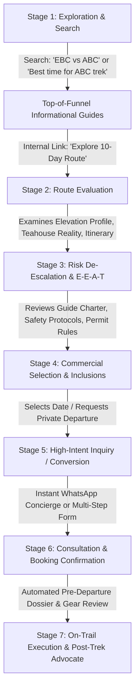
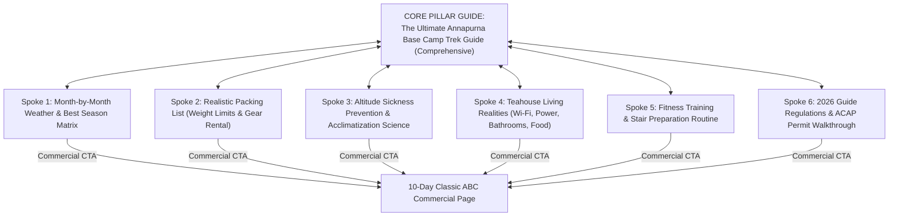

# STRATEGIC FOUNDATION & PRODUCT BLUEPRINT
## Brand: ABC Trek in Nepal (`abctrekinnepal.com`)
**Document Version:** 1.0 (Pre-Development Strategic Baseline)  
**Lead Roles:** Lead Website Strategist, Information Architect, UX Strategist, SEO Strategist, Senior Web Product Designer  

---

## EXECUTIVE SUMMARY & PURPOSE

This document establishes the strategic, architectural, UX, SEO, and visual foundation for **ABC Trek in Nepal** (`https://abctrekinnepal.com/`). 

The brand is positioned as a **definitive high-altitude specialist** dedicated to the Annapurna Base Camp (Sanctuary) Trek, built to scale systematically into broader Annapurna and Nepal trekking expeditions. The website departs radically from generic, overcrowded Thamel travel-agency templates. Instead, it embodies a **premium, cinematic, editorial, and trustworthy** digital experience that matches the standards of premier global adventure operators while retaining deep, authentic local authority and E-E-A-T (Experience, Expertise, Authoritativeness, and Trustworthiness).

---

## 1. BRAND POSITIONING & CORE VALUE PROPOSITION

### 1.1 Brand Identity & Market Positioning
* **Brand Name:** ABC Trek in Nepal
* **Domain:** `https://abctrekinnepal.com/`
* **Core Brand Identity:** The definitive, specialist authority for the Annapurna Base Camp (ABC) trek and the Annapurna Sanctuary basin.
* **Positioning Statement:** 
  > *"For international travelers seeking the quintessential Himalayan journey, ABC Trek in Nepal provides masterfully guided, safety-first expeditions to the Annapurna Sanctuary. Unlike multi-country brokers or generic agencies offering 500 superficial tours, we are dedicated Annapurna specialists—combining transparent logistics, conservative high-altitude protocols, ethical Sherpa/Gurung guiding, and editorial-grade trail intelligence."*

### 1.2 The Four Distinctive Brand Pillars
1. **Specialist Mastery over Generalist Dilution:** Rather than treating ABC as listing #48 in an endless catalog, we engineer every variation of the Annapurna Base Camp trek with precision pacing, hand-selected teahouse logistics, and dedicated mountain guides.
2. **Transparent Alpine Telemetry:** No sugarcoated walking times or vague "moderate" ratings. We deliver honest daily elevation differentials, exact stair-count expectations (e.g., the 3,300 steps of Ulleri and the steep Chhomrong descent/ascent), and transparent teahouse realities (charging, Wi-Fi, heating).
3. **Ethical Himalayan Stewardship & Porter Welfare:** Absolute adherence to the International Porter Protection Group (IPPG) guidelines: maximum load limits (20–25kg max per porter, 1 porter per 2 trekkers), cold-weather high-altitude clothing, comprehensive rescue insurance, and fair-wage guarantees.
4. **Clinical Safety & Acclimatization Discipline:** Wilderness First Responder (WFR) trained guides carrying daily pulse oximeters, supplemental medical kits, Lake Louise AMS scoring protocols, and pre-established helicopter evacuation protocols.

### 1.3 Design & Visual Aesthetics
* **Brand Palette:**
  * **White (`#FFFFFF`):** Dominant surface canvas, generous breathing room, editorial purity.
  * **Dark Blue (`#0F2D5C`):** Primary headings, navigation bars, typography, structural lines, trust badges, authority signals.
  * **Vibrant Alpine Orange (`#F97316`):** Action-driver; used exclusively for primary CTAs, active route highlights, interactive markers, and key urgency/booking cues.
  * **Neutral Slates & Tints (Supporting):** `#F8FAFC` (subtle background contrast), `#E2E8F0` (delicate hairline dividers), `#334155` (high-legibility body text).
* **Visual Direction:**
  * *Editorial & Cinematic:* Expansive Himalayan panoramas with natural color grading, refined typography (modern serif accents paired with crisp grotesque sans-serif for UI readability).
  * *Zero Fluff & Gimmicks:* No excessive cards, no bubbly rounded containers, no gratuitous gradients or distracting bouncing animations, no cheap travel-agency badges.
  * *Crisp Informational Surfaces:* Technical elevation graphs, route profile cross-sections, structured comparison matrices, and clean typography.

---

## 2. TARGET AUDIENCE SEGMENTS & BEHAVIORAL ARCHETYPES

| Segment Name | Demographics & Profile | Primary Motivations | Anxieties & Friction Points | UX / Content Solution |
| :--- | :--- | :--- | :--- | :--- |
| **1. The First-Time Himalayan Trekker** | Ages 25–45. Professionals from Europe, US, UK, Australia, Singapore. Fit hikers/gym-goers with zero high-altitude (>3,500m) experience. | Experiencing the Himalayas safely; seeing 8,000m peaks without the intense physical threat or extreme duration of Everest Base Camp. | Acute Mountain Sickness (AMS), food poisoning, freezing cold, sanitary conditions of teahouses, booking with an unknown overseas operator. | Comprehensive safety protocols, medical kit transparency, teahouse photo tours, detailed packing checklists, transparent "what's included" lists. |
| **2. The Independent Hiker Upgrading to Supported Trek** | Ages 28–58. Experienced in self-supported trails (Patagonia, Tour du Mont Blanc, US National Parks). | Wants high autonomy and authentic cultural connection, but respects Nepal’s 2023+ mandatory guide regulations and values local logistics. | Being micromanaged, trapped in slow/noisy group tours, paying inflated middleman commissions. | Private departure options, flexible daily pacing, profiles of certified local guides, breakdown of guide credentials and autonomy. |
| **3. The Time-Constrained Adventure Traveler** | Ages 30–52. Corporate professionals or active couples with a strict 10–14 day total leave window. | Needs maximum experiential payoff in limited time; compares ABC (7–10 days on trail) favorably against EBC (12–16 days). | Flight delays, inefficient logistics between Kathmandu and Pokhara, wasting days on road transits. | Precision itineraries (Express 7-Day via Pokhara vs Classic 10-Day), private jeep transit options to trailheads (Siwai/Ghandruk), clear transfer schedules. |
| **4. Private Groups & Couples** | Ages 30–65. Couples celebrating milestones, small groups of friends, or active family units. | Customized pacing, private rooms/attached bathrooms where possible, private transport, tailored dietary needs. | Sharing crowded dormitory spaces, mismatched physical pacing with strangers. | Clear "Private Expedition" toggle, room upgrade availability notes (Pokhara/lower trail teahouses), customized inquiry flow. |

---

## 3. PRIMARY USER JOURNEYS (DISCOVERY TO POST-TREK)



### Key Touchpoints by Stage:
1. **Stage 1: Exploration & Problem Formulation**
   * *User Mindset:* "Is ABC right for my fitness level? When should I go?"
   * *Core Touchpoints:* Comprehensive Seasonality Guide, Altitude & Acclimatization Deep-Dive, ABC vs EBC Comparison Table.
2. **Stage 2: Route & Commercial Evaluation**
   * *User Mindset:* "Which itinerary fits my 12 days in Nepal? Classic 10-day or Express 7-day?"
   * *Core Touchpoints:* Route comparison matrix, interactive elevation profiles, day-by-day telemetry with guide notes.
3. **Stage 3: Trust & Risk De-Escalation**
   * *User Mindset:* "Are these people legitimate? What happens if I get sick at Machhapuchhre Base Camp?"
   * *Core Touchpoints:* Medical & helicopter evacuation breakdown, Guide & Porter Welfare Charter, clear registration numbers (to be verified).
4. **Stage 4: Decision & Inquiry**
   * *User Mindset:* "What is the true cost? Are permits and transport included?"
   * *Core Touchpoints:* Crystal-clear Inclusions/Exclusions ledger, transparent deposit/cancellation policies, frictionless multi-step inquiry modal or direct WhatsApp routing.
5. **Stage 5: Post-Inquiry Onboarding**
   * *User Mindset:* "I booked. How do I prepare my gear and flights?"
   * *Core Touchpoints:* Downloadable PDF preparation dossier, Kathmandu/Pokhara arrival guide, recommended packing checklist with rental options.

---

## 4. SEARCH-INTENT FRAMEWORK

The search strategy aligns tightly with search intent categories, avoiding keyword stuffing and focusing on comprehensive information fulfillment:

| Intent Category | Search Queries / Topics | Primary Page Type | User Intent Goal | Business Goal |
| :--- | :--- | :--- | :--- | :--- |
| **Transactional (BoFU)** | "Book Annapurna Base Camp trek", "Annapurna Base Camp guided tour price", "ABC trek private guide booking" | Primary Commercial / Product Page | Immediate commercial booking or quote request. | Lead generation, direct booking conversion. |
| **Commercial Investigation (MoFU)** | "Best Annapurna Base Camp trekking agency", "ABC trek 10 day vs 7 day", "Annapurna Base Camp cost breakdown", "ABC trek packages from Pokhara" | Product Comparison & Route Variations Pages | Compare operators, itineraries, prices, and quality of service. | Prove superiority through transparency, E-E-A-T, and premium logistics. |
| **Informational (ToFU)** | "Annapurna Base Camp altitude sickness", "Best month to trek ABC Nepal", "ABC trek difficulty and fitness", "Annapurna Base Camp packing list" | Pillar Guides & Topic Clusters (Hub & Spoke) | Gather factual answers to solve planning challenges. | Capture organic search traffic, establish topical authority, route to commercial pages. |
| **Navigational / Brand** | "ABC Trek in Nepal", "ABC Trek in Nepal contact", "abctrekinnepal reviews" | Homepage, About, Contact Pages | Verify the company identity, reach customer support, or check credentials. | Reinforce brand trust, provide immediate direct communication. |

---

## 5. TOPICAL & ENTITY FRAMEWORK (KNOWLEDGE GRAPH)

Google assesses topical authority by analyzing semantic relationships between named entities, concepts, and geographical structures.

### 5.1 Primary Brand Entity
* **Entity:** `ABC Trek in Nepal`
* **Entity Type:** `TouristInformationCenter` / `TravelAgency` / `SportsOrganization`
* **Core Semantic Role:** The primary specialized provider of Annapurna Base Camp expeditions in Nepal.

### 5.2 Entity Hierarchy & Relationships
```
[Nepal (Country)]
   └── [Himalayas (Mountain Range)]
         └── [Gandaki Province]
               ├── [Kathmandu] (Logistical Hub / International Gateway)
               └── [Pokhara] (Staging City / Trailhead Gateway)
                     └── [Annapurna Conservation Area (Protected Area)]
                           └── [Annapurna Sanctuary (Glacial Basin)]
                                 ├── [Annapurna Base Camp (ABC - 4,130m)] (Destination Entity)
                                 ├── [Machhapuchhre Base Camp (MBC - 3,700m)]
                                 ├── [Associated Peaks]
                                 │     ├── Annapurna I (8,091m)
                                 │     ├── Machhapuchhre / Fishtail (6,993m)
                                 │     ├── Annapurna South (7,219m)
                                 │     ├── Hiunchuli (6,441m)
                                 │     └── Gangapurna (7,455m)
                                 └── [Trail Waypoints & Cultural Villages]
                                       ├── Nayapul / Birethanti (Historical Trailheads)
                                       ├── Siwai / Matque (Modern Jeep Trailheads)
                                       ├── Ulleri (3,300 Stone Steps / Magar Village)
                                       ├── Ghorepani & Poon Hill (3,210m Sunrise Vantage)
                                       ├── Tadapani & Chuile (Forest Passages)
                                       ├── Ghandruk (Gurung Heritage Hub)
                                       ├── Chhomrong (Gateway to the Modi Khola Gorge)
                                       ├── Sinuwa, Bamboo, Dovan, Deurali (Sanctuary Corridor)
                                       └── Jhinu Danda (Natural Riverside Hot Springs)
```

### 5.3 Technical & Logistical Entities
* **Permits:** Annapurna Conservation Area Permit (ACAP), NTNC (National Trust for Nature Conservation), Trekkers' Information Management System (TIMS - historical context vs 2023+ mandatory guide regulation).
* **High-Altitude Physiology:** Acute Mountain Sickness (AMS), High Altitude Pulmonary Edema (HAPE), High Altitude Cerebral Edema (HACE), Acclimatization profile, Acetazolamide (Diamox), Pulse Oximetry ($SpO_2$).
* **Cultural & Operational Terms:** Teahouse lodge, Dal Bhat (energy staple), Sherpa, Gurung, Porter, Licensed Mountain Guide (NMA/TAAN/Govt certification).

---

## 6. WEBSITE CONTENT ARCHITECTURE (SITEMAP & HIERARCHY)

```
abctrekinnepal.com/
│
├── / (Homepage: Brand Anchor, Value Proposition, Route Showcase, Trust Signals)
│
├── /treks/ (Commercial Overview Hub: All Annapurna Expeditions)
│   │
│   ├── /treks/annapurna-base-camp-classic-10-days/ (Primary Commercial Flagship: The Benchmark Route)
│   ├── /treks/annapurna-base-camp-express-7-days/ (Short/Fast Route for Fit/Time-Constrained Trekkers)
│   ├── /treks/annapurna-base-camp-via-poon-hill-12-days/ (Scenic Combination: Sunrise + Sanctuary)
│   ├── /treks/annapurna-sanctuary-ghandruk-circuit-14-days/ (Full Cultural & Mountain Immersion)
│   └── /treks/private-custom-expeditions/ (Bespoke Group & VIP Departures)
│
├── /expansion/ (Strategic Regional Expansion - Future Growth Modules)
│   ├── /treks/mardi-himal-trek/ (Ridge-Trek Alternative)
│   ├── /treks/poon-hill-short-trek-4-days/ (Introductory Himalayan Trek)
│   └── /treks/annapurna-circuit-trek/ (Long-Distance Regional Companion)
│
├── /guide/ (Informational Pillar Hub: Topical Authority Center)
│   │
│   ├── /guide/annapurna-base-camp-ultimate-guide/ (Massive Core Pillar Guide)
│   ├── /guide/best-time-to-trek-annapurna-base-camp/ (Seasonality, Weather, Month-by-Month Matrix)
│   ├── /guide/annapurna-base-camp-packing-list/ (Comprehensive Gear Checklist & Rental Guide)
│   ├── /guide/altitude-sickness-acclimatization-abc/ (Medical Protocols, Elevation Profile, Safety)
│   ├── /guide/teahouse-food-accommodation-annapurna/ (Living Realities: Wi-Fi, Showers, Power, Food)
│   ├── /guide/abc-trek-difficulty-fitness-training/ (Physical Preparation, Cardio, Stair Workouts)
│   └── /guide/permits-regulations-mandatory-guide-rules/ (Legal Requirements, ACAP, 2026 Rules)
│
├── /safety-ethics/ (E-E-A-T & Trust Hub)
│   ├── /safety-ethics/high-altitude-safety-evacuation/ (Protocols, Satellite Comms, Heli-Rescue)
│   ├── /safety-ethics/guide-porter-welfare-charter/ (Fair Wages, Weight Limits, Gear, Insurance)
│   └── /safety-ethics/responsible-himalayan-travel/ (Leave No Trace, Waste Management, Community Support)
│
├── /company/ (Trust & Institutional Pages)
│   ├── /about-us/ (Founder story, alpine pedigree, why we specialize in Annapurna)
│   ├── /our-guides/ (Bios of licensed local guides with safety certifications)
│   ├── /reviews-guest-stories/ (Authentic verified client experiences)
│   ├── /pricing-booking-terms/ (Deposit terms, refund policy, cancellation transparency)
│   └── /contact/ (Direct inquiry form, Pokhara/Kathmandu office locations, WhatsApp dispatch)
│
└── Legal & Utilities
    ├── /privacy-policy/
    └── /terms-conditions/
```

---

## 7. COMMERCIAL PAGE FRAMEWORK (HIGH-CONVERTING TREK DETAIL UX)

Every commercial page (e.g., `10-Day Classic ABC Trek`) must function as a high-converting, deeply informative money page that eliminates guesswork and builds immediate trust.

### Structural Blueprint for Commercial Trek Pages:
1. **Sticky Micro-Header (Appears on Scroll):**
   * Trek Name | Duration (e.g., 10 Days) | Max Alt: 4,130m | Starting Price | CTA Button: "Inquire Now / Check Dates" (Orange `#F97316`).
2. **Hero Section (Cinematic & Data-Dense):**
   * High-definition photography of the Annapurna amphitheater at dawn.
   * Breadcrumb navigation (`Home > Treks > Annapurna Base Camp Classic`).
   * Primary `<h1>`: Annapurna Base Camp Trek – The Classic 10-Day Sanctuary Expedition.
   * Telemetry Strip (Key facts at a glance):
     * **Duration:** 10 Days / 9 Nights (Pokhara to Pokhara)
     * **Max Elevation:** 4,130 m / 13,550 ft (Annapurna Base Camp)
     * **Grade / Difficulty:** Moderate to Strenuous
     * **Accommodation:** Teahouse Lodges (Mountain Standard)
     * **Required Permits:** ACAP (Annapurna Conservation Area Permit)
     * **Best Seasons:** Autumn (Oct–Nov) & Spring (Mar–May)
3. **Route Cross-Section Elevation Graphic:**
   * Interactive SVG/Canvas graphic plotting day-by-day altitude progression from Pokhara (820m) through Chhomrong (2,170m), Deurali (3,230m), MBC (3,700m), to ABC (4,130m).
   * Visual indicators highlighting safe sleeping thresholds and acclimatization checkpoints.
4. **Editorial Route Overview & "Why This Route Works":**
   * Why the 10-day pacing prevents altitude complications compared to rushed 6-day itineraries.
   * Key highlights: 360-degree panorama of Annapurna I (8,091m), Machhapuchhre, Annapurna South; natural hot springs at Jhinu Danda.
5. **Day-by-Day Interactive Itinerary Accordion:**
   * *Telemetry per day:* Starting elevation, ending elevation, net altitude gain/loss, estimated walking hours, distance in km.
   * *Trail narrative:* Terrains encountered (stone stairs, bamboo forests, glacial moraines).
   * *Guide Insider Note:* Practical tips (e.g., "Charge electronics in Chhomrong; battery drain accelerates past Deurali").
   * *Meal & Overnight Stop:* Clear lodging indicators.
6. **The Transparent Inclusions & Exclusions Ledger:**
   * Two high-contrast columns (Green checkmarks vs. clear grey exclusion notices).
   * *Inclusions:* All ACAP permits, licensed English-speaking guide, insured porters, all teahouse lodging, 3 daily meals on trail with hot tea, private road transport Pokhara-trailhead, medical oximeter checks, staff insurance.
   * *Exclusions:* International flights, Nepal entry visa, travel & emergency helicopter evacuation insurance (mandatory), hot showers/Wi-Fi/device charging fees at teahouses, personal gear, tips for guide/porter.
7. **Teahouse & Trail Living Reality Module:**
   * Frank photography and descriptions of teahouses at high elevation (unheated rooms, communal heated dining halls, squat/western toilet reality, menu options from Dal Bhat to porridge).
8. **Altitude & Medical Safety Protocol on this Specific Route:**
   * Daily monitoring procedure ($SpO_2$ blood oxygen checks every morning and evening).
   * Descent and evacuation route plan from MBC/ABC.
9. **Curated Packing Essentials for this Route:**
   * Direct summary of critical gear (sleeping bag -10°C rating, microspikes for winter/spring moraine, broken-in trekking boots, trekking poles for downhill knee relief).
10. **Targeted Route FAQs:**
    * 6–8 high-intent FAQs answering specific route questions without generic boilerplate.
11. **Conversion Drawer / Floating Mobile CTA:**
    * Bottom bar locked on mobile displays: Price + "Inquire on WhatsApp" + "Customize Trip".

---

## 8. INFORMATIONAL CONTENT FRAMEWORK (TOPICAL HUBS & SPOKES)

To establish undisputed search dominance and genuine topical authority, informational content must provide **verifiable information gain** that answers specific traveler questions better than TripAdvisor forums or outdated blogs.

### 8.1 The Pillar & Spoke Cluster Model



### 8.2 Content Standards for Every Guide
* **No Fluff Policy:** The first 150 words must directly deliver the core answer (e.g., in the Seasonality Guide, provide the exact temperature and rainfall chart upfront).
* **Information Gain Features:**
  * Comparative tables (e.g., Autumn vs Spring vs Winter on ABC).
  * High-altitude medical facts reviewed against wilderness medical guidelines.
  * Real pricing ranges for incidental teahouse costs (hot showers: NPR 300–500; device charging: NPR 200–400 per charge/powerbank).

---

## 9. TRUST & E-E-A-T FRAMEWORK (FACTUAL ACCURACY & EVIDENCE)

Google's quality rater guidelines place travel bookings and high-altitude treks squarely in the **YMYL (Your Money Your Life)** category due to physical safety risks and significant financial commitments.

### 9.1 Classification of Facts & Claims

```
┌─────────────────────────────────────────────────────────────────────────────┐
│ 1. VERIFIED GEOGRAPHICAL & PHYSIOLOGICAL FACTS (Publish with Confidence)    │
│    - ABC Altitude: 4,130m (13,550 ft); MBC: 3,700m; Deurali: 3,230m.         │
│    - ACAP Permit cost: NPR 3,000 (~$23 USD) for foreign nationals.          │
│    - Mountain geography: Annapurna I is the 10th highest peak (8,091m).     │
│    - Acute Mountain Sickness (AMS) risks occur primarily above 2,500m.       │
├─────────────────────────────────────────────────────────────────────────────┤
│ 2. BUSINESS-SPECIFIC FACTS REQUIRING CONFIRMATION BEFORE PUBLICATION       │
│    - Government Registration / Department of Tourism license numbers.       │
│    - TAAN (Trekking Agencies Association of Nepal) official membership ID.  │
│    - Exact physical office address in Pokhara (Lakeside) & Kathmandu.       │
│    - Specific names and government certification badge numbers of guides.   │
│    - Verified third-party review URLs (TripAdvisor, Google Maps profile).   │
├─────────────────────────────────────────────────────────────────────────────┤
│ 3. CONTENT RECOMMENDATIONS (Actionable Best Practices)                      │
│    - Recommending 1 porter per 2 trekkers with a 20kg aggregate cap.        │
│    - Recommending travel insurance explicitly covering trekking up to 4,500m│
│      and emergency helicopter evacuation.                                   │
│    - Recommending Diamox dosage (125mg–250mg) only after doctor consult.    │
├─────────────────────────────────────────────────────────────────────────────┤
│ 4. STRICT PROHIBITIONS (Zero Tolerance for Hallucinations)                  │
│    - NO fake "5.0 Stars based on 10,000+ reviews" counters.                │
│    - NO fabricated "Voted #1 Trekking Agency in Nepal" badges.              │
│    - NO stock photos of models labeled as "Our Sherpa Team".                │
│    - NO false claims of owning helicopter rescue fleets.                    │
└─────────────────────────────────────────────────────────────────────────────┘
```

### 9.2 Concrete E-E-A-T Infrastructure on Site
* **Guide & Porter Welfare Charter Page:** A standalone commitment page detailing insurance policies, minimum gear standards, load limits, and wage fairness.
* **Author Credentials on All Educational Guides:** Bylines from certified trekking guides and wilderness responders explaining route specifics.
* **Transparent Emergency Playbook:** Clear step-by-step breakdown of what happens when a trekker experiences moderate or severe AMS between Bamboo and Annapurna Base Camp.

---

## 10. HOMEPAGE STRATEGIC FRAMEWORK

The homepage is the flagship brand anchor. It must balance commercial efficiency, brand elevation, and semantic clarity without devolving into an aggressive sales landing page.

### 10.1 Section-by-Section Homepage Anatomy

```
┌─────────────────────────────────────────────────────────────────────────────┐
│ 1. CINEMATIC EDITORIAL HERO SECTION                                         │
│    - Background: Crisp, full-width dawn capture of Annapurna Sanctuary.    │
│    - Heading: The Definitive Annapurna Base Camp Trek Specialists.          │
│    - Subheading: Thoughtfully paced, safety-led Himalayan expeditions to    │
│      the 4,130m amphitheater of giants. Operated by licensed local experts.│
│    - Primary CTA (Orange #F97316): "Explore ABC Expeditions"               │
│    - Secondary CTA (White/Outline): "View 2026 Seasonality & Route Guide"   │
├─────────────────────────────────────────────────────────────────────────────┤
│ 2. TRUST & INTEGRITY STRIP (Subtle dark blue bar)                          │
│    - Verified Nepal Govt Registration Placeholder                           │
│    - 100% Licensed Himalayan Mountain Guides                                │
│    - Strict Porter Protection Standards (IPPG Compliant)                   │
│    - Comprehensive Wilderness Medical & Evacuation Protocols                │
├─────────────────────────────────────────────────────────────────────────────┤
│ 3. BRAND MANIFESTO: WHY AN ANNAPURNA SPECIALIST?                            │
│    - Editorial 2-column layout: The distinction between generalist tour     │
│      resellers and focused Annapurna Sanctuary craftsmen.                   │
│    - Focus on safety, acclimatization schedules, and teahouse relationships.│
├─────────────────────────────────────────────────────────────────────────────┤
│ 4. THE SIGNATURE ABC EXPEDITIONS SHOWCASE (Curated Trio)                   │
│    - Card 1: The 10-Day Classic Sanctuary (The gold-standard route).        │
│    - Card 2: The 7-Day Express Route (For time-constrained, fit trekkers).  │
│    - Card 3: The 12-Day Sanctuary via Poon Hill (Sunrise panoramic combo).  │
│    - Each card displays: Duration, Max Altitude, Difficulty, Key Highlight. │
├─────────────────────────────────────────────────────────────────────────────┤
│ 5. INTERACTIVE TRAIL TELEMETRY & ROUTE HIGHLIGHTS                           │
│    - 4,130m Base Camp Basin | 3,300 Ulleri Steps | Modi Khola River Canyon  │
│    - Micro-explorations of the terrain, rhododendron forests, and peaks.    │
├─────────────────────────────────────────────────────────────────────────────┤
│ 6. THE SAFETY & HIGH-ALTITUDE STANDARD                                      │
│    - Visual breakdown of medical kits, daily pulse oximetry, AMS scoring,   │
│      and emergency satellite/heli dispatch protocols.                       │
├─────────────────────────────────────────────────────────────────────────────┤
│ 7. ETHICAL MOUNTAIN STEWARDSHIP (Porters & Communities)                    │
│    - Transparent porter treatment policy, fair wages, and gear provision.   │
│    - Community support in Gurung villages (Chhomrong, Ghandruk).            │
├─────────────────────────────────────────────────────────────────────────────┤
│ 8. VERIFIED TRAVELER EXPERIENCES & STORIES (Real Data Architecture)        │
│    - Reserved space for authenticated customer stories, verified reviews,   │
│      and direct links to third-party review platforms once established.     │
├─────────────────────────────────────────────────────────────────────────────┤
│ 9. ESSENTIAL PLANNING INTELLIGENCE (Direct Links to Pillar Guides)         │
│    - Best Time to Go | Packing Checklist | Altitude Safety | 2026 Rules     │
├─────────────────────────────────────────────────────────────────────────────┤
│ 10. PRE-FOOTER INVITATION / BESPOKE EXPEDITION CONCIERGE                    │
│     - "Planning your Annapurna trek for 2026? Speak directly with our lead  │
│        mountain operations team."                                           │
│     - Form trigger + Direct WhatsApp link.                                  │
└─────────────────────────────────────────────────────────────────────────────┘
```

---

## 11. CONVERSION STRATEGY & UX DESIGN

High-value adventure travel involves long consideration cycles ($800–$2,500+ investment per traveler, plus international flights and gear). The conversion system must nurture both instant high-intent inquiries and mid-funnel researchers.

### 11.1 Conversion Funnel Architecture
1. **Primary Conversion (Macro-Goal): Direct Trip Inquiry / Custom Date Booking**
   * *Mechanism:* Low-friction multi-step modal form:
     * Step 1: Select Route (10-Day Classic, 7-Day Express, 12-Day Poon Hill, Custom).
     * Step 2: Select Intended Month/Season & Group Size (Solo, Couple, Private Group).
     * Step 3: Contact Details (Name, Email, WhatsApp Number for fast response).
   * *Guarantee:* Guaranteed response within 12 hours from a licensed route director (not a call center bot).
2. **Instant Concierge Conversion: WhatsApp Direct Dispatch**
   * Floating, unobtrusive WhatsApp button (positioned lower-right) with pre-filled context: *"Hi, I am planning an Annapurna Base Camp trek for [Month] and would like to ask a few questions."*
   * Caters to European, Australian, and international travelers accustomed to mobile messenger communications.
3. **Secondary Conversion (Micro-Goal / Lead Capture): High-Value Planning Assets**
   * *"Download the Complete 2026 Annapurna Base Camp Expedition Dossier (PDF)"* (Includes high-res route map, elevation graph, full packing checklist, and training program).
   * Generates qualified email leads for nurturing pre-trek travelers 6–12 months prior to their trip.

### 11.2 Reducing Friction & Abandonment
* **Transparent Pricing Guarantee:** Clear explanation of what incidental costs to expect on the mountain so the traveler never feels misled by hidden fees.
* **Flexible Booking & Rescheduling Policy:** Clear policies accommodating flight changes or unexpected health delays.

---

## 12. SEMANTIC SEO STRATEGY & TECHNICAL ARCHITECTURE

### 12.1 URL Architecture
* Flat, logical, human-readable hierarchy:
  * Commercial: `abctrekinnepal.com/treks/annapurna-base-camp-classic-10-days/`
  * Informational: `abctrekinnepal.com/guide/best-time-to-trek-annapurna-base-camp/`
  * Institutional: `abctrekinnepal.com/safety-ethics/guide-porter-welfare-charter/`

### 12.2 Structured Data (Schema.org) Blueprint
To secure rich snippets, FAQ dropdowns, and knowledge graph ingestion, pages will embed JSON-LD schema:
1. **Homepage:** `TravelAgency` & `TouristInformationCenter`
   * Name, URL, logo, serviceArea (`Annapurna Conservation Area`), priceRange, contactPoint, knowsAbout (`Annapurna Base Camp Trek`, `Himalayan Trekking`).
2. **Commercial Trek Pages:** `TouristTrip` & `Trip` & `Product` / `Offer`
   * `name`: Annapurna Base Camp Trek - Classic 10 Days
   * `touristType`: Adventure travelers, Hikers
   * `itinerary`: Ordered array of `ItemList` featuring `City` and `Place` waypoints with geo-coordinates.
   * `offers`: Structured price, currency (`USD`), availability, validFrom.
3. **Pillar & Educational Guides:** `Article` & `HowTo`
   * Author with schema referencing a credentialed mountain guide.
4. **FAQ Sections:** `FAQPage`
   * Valid Q&A pairs embedded to earn rich snippet expansion in Google SERPs.

### 12.3 Contextual Internal Linking Strategy
* **Strict Thematic Relevance:** Links are placed inside contextual sentences, not arbitrary link clouds.
* **Bidirectional Synergy:** 
  * Every educational spoke (e.g., Packing List) links directly to the specific commercial itineraries that utilize that gear.
  * Every commercial itinerary links to the technical guides (e.g., Altitude Guide, Packing List, Weather Guide) in its preparation tabs.
* **Descriptive, Entity-Rich Anchor Text:** Use phrases like "our 10-day Annapurna Sanctuary itinerary", "Annapurna Conservation Area permit requirements", and "acclimatization schedule above Deurali" rather than generic "click here".

---

## 13. COMPETITOR OBSERVATIONS (STRENGTHS & DEFICIENCIES)

An analysis of leading local agencies (e.g., Nepal Hiking Team, Mountain Company, local Thamel sites) and global aggregators (e.g., Bookatrekkers, TourRadar, Viator) reveals critical market opportunities:

| Competitor Feature | What Competitors Do Well | Where Competitors Fail | ABC Trek in Nepal Strategic Advantage |
| :--- | :--- | :--- | :--- |
| **Visual Design & Aesthetics** | High volume of images. | Visual clutter, 1990s-style tables, excessive badges, overwhelming dropdown menus, low-res compressed photos. | Premium editorial layout, cinematic typography, generous white space, restrained palette (`#0F2D5C`, `#F97316`, `#FFFFFF`). |
| **Information Architecture** | Large catalogs of 80+ treks. | Diluted focus; Annapurna Base Camp is lost among Everest, Langtang, Manaslu, and Tibet tours. | Clear specialist authority: Annapurna Base Camp is our marquee focus and hero product. |
| **Pricing & Inclusions** | Display low headline prices ($600–$800). | Hidden omissions: domestic flights, ground transport, hot showers, charging, Wi-Fi, and tipping are buried in fine print. | Transparent Inclusions/Exclusions ledger with honest estimates of on-trail incidentals. |
| **Mobile UX & Responsiveness** | Most have basic responsive templates. | Clunky day-by-day accordions, difficult-to-read elevation tables, missing mobile sticky inquiry actions. | Built with mobile-first sticky action bars, touch-friendly elevation profiles, and instant WhatsApp concierge integration. |
| **E-E-A-T & Trust Signals** | Post dozens of TripAdvisor badges. | Obvious fake counters, generic testimonials with stock photos, no genuine guide profiles or safety data. | Verifiable facts, authentic guide credentialing, transparent medical equipment disclosures, zero fake review claims. |

---

## 14. INFORMATION-GAP OPPORTUNITIES (INFORMATION GAIN)

Most existing websites publish repetitive, recycled text copied from old guidebooks. By addressing critical information gaps with deep, authentic facts, `abctrekinnepal.com` will achieve superior search ranking and user conversion:

1. **The Teahouse Living Reality Gap:**
   * *The Gap:* Competitors vaguely promise "comfortable teahouse accommodation" without explaining that rooms are unheated, walls are thin plywood, and hot showers cost extra via gas geysers.
   * *Our Advantage:* A realistic photo-and-fact breakdown of teahouse life by altitude zone (Pokhara luxury vs Chhomrong standard vs Deurali/ABC basic dormitories).
2. **The "Stairs of Ulleri & Chhomrong" Physical Reality Gap:**
   * *The Gap:* Standard itineraries say "Trek from Tikhedhunga to Ghorepani (5 hours)." They omit that trekkers must climb 3,300 steep stone steps in direct sun.
   * *Our Advantage:* Precise trail topography notes with staircase elevation grades, descent advice for knee preservation, and trekking pole techniques.
3. **The 2026 Guide & Permit Regulations Clarity Gap:**
   * *The Gap:* Outdated blogs still reference old TIMS card rules or give conflicting reports about mandatory guide rules introduced in 2023.
   * *Our Advantage:* An up-to-date, transparent explanation of the legal framework, official ACAP permit checkpoints, and why professional guiding ensures safety and compliance.
4. **The Daily Micro-Climate & Shadow Effect in the Sanctuary:**
   * *The Gap:* Competitors give generic "Pokhara weather" averages.
   * *Our Advantage:* Explaining the microclimate of the Annapurna Basin—clear, freezing mornings with early morning sunshine hitting Annapurna South, followed by rapid afternoon cloud accumulation and temperature drops past Bamboo.
5. **The Realistic Incidental Trail Budget:**
   * *The Gap:* Trekkers don't know how many Nepalese Rupees in cash to bring for water, snacks, showers, Wi-Fi, and tips.
   * *Our Advantage:* An exact daily cash-planning table (recommending NPR 2,500–3,500 per day in small denominations) since there are no ATMs past Chhomrong.

---

## 15. RECOMMENDED DEVELOPMENT SEQUENCE

To execute this vision cleanly without technical debt, the website must be built in methodical, phased sprints:

```
┌─────────────────────────────────────────────────────────────────────────────┐
│ PHASE 1: STRATEGIC & ARCHITECTURAL SIGN-OFF (CURRENT MILESTONE)             │
│ - Finalize Brand Positioning, Information Architecture, and Entity Matrix.   │
│ - Validate business data requirements and factual verification checklist.    │
└─────────────────────────────────────┬───────────────────────────────────────┘
                                      │
┌─────────────────────────────────────▼───────────────────────────────────────┐
│ PHASE 2: DESIGN SYSTEM & CORE TOKENS                                        │
│ - CSS design system implementation (Custom Vanilla CSS).                    │
│ - Color tokens: #FFFFFF (Canvas), #0F2D5C (Navy), #F97316 (Action Orange).  │
│ - Typography hierarchy (Google Fonts: Outfit / Inter or Plus Jakarta Sans). │
│ - UI component library: Buttons, Badges, Accordions, Telemetry Cards,       │
│   Elevation SVG Containers, Responsive Navigation, Mobile Drawer.           │
└─────────────────────────────────────┬───────────────────────────────────────┘
                                      │
┌─────────────────────────────────────▼───────────────────────────────────────┐
│ PHASE 3: CORE COMMERCIAL ROUTE TEMPLATES                                    │
│ - Build the Flagship 10-Day Classic Annapurna Base Camp Trek page.          │
│ - Build the 7-Day Express and 12-Day Poon Hill combo route pages.           │
│ - Implement interactive elevation profile, itinerary accordions, and        │
│   inclusions/exclusions comparison matrices.                                │
│ - Mobile-first sticky inquiry & WhatsApp booking bar.                       │
└─────────────────────────────────────┬───────────────────────────────────────┘
                                      │
┌─────────────────────────────────────▼───────────────────────────────────────┐
│ PHASE 4: HOMEPAGE & BRAND IDENTITY ASSEMBLY                                 │
│ - Assemble the high-impact editorial homepage following Section 10 anatomy. │
│ - Implement trust bar, signature route selector, and telemetry highlights.  │
│ - Integrate verified inquiry modal and direct contact triggers.             │
└─────────────────────────────────────┬───────────────────────────────────────┘
                                      │
┌─────────────────────────────────────▼───────────────────────────────────────┐
│ PHASE 5: INFORMATIONAL HUBS & E-E-A-T TRUST ARCHITECTURE                    │
│ - Build the Ultimate Guide to ABC Trek pillar template.                     │
│ - Build standalone spokes: Packing List, Altitude Guide, Best Time to Trek. │
│ - Deploy Guide & Porter Welfare Charter, Safety Protocols, and About pages. │
└─────────────────────────────────────┬───────────────────────────────────────┘
                                      │
┌─────────────────────────────────────▼───────────────────────────────────────┐
│ PHASE 6: SEMANTIC SEO, SCHEMA VALIDATION & PERFORMANCE AUDIT                 │
│ - Inject full JSON-LD structured data (TouristTrip, TravelAgency, FAQPage). │
│ - Run Core Web Vitals audit (LCP, CLS, FID) to ensure lightning load speed. │
│ - Check cross-browser compatibility and responsive ergonomics.              │
└─────────────────────────────────────────────────────────────────────────────┘
```

---

## 16. PRE-DEVELOPMENT BUSINESS VERIFICATION CHECKLIST

Before drafting final marketing copy or publishing company details in subsequent prompts, the business owner/stakeholder should provide confirmation for the following items:

* [ ] **Official Company Registration Details:** Exact registered legal entity name in Nepal and Company Registrar Office (CRO) number.
* [ ] **Tourism License Number:** Department of Tourism (DoT) registration number.
* [ ] **Industry Affiliations:** Confirm active membership in TAAN (Trekking Agencies' Association of Nepal) and NMA (Nepal Mountaineering Association).
* [ ] **Physical Office Locations:** Exact physical addresses for the primary operating office (Pokhara - Lakeside / Kathmandu - Thamel).
* [ ] **Direct Contact Endpoints:** Official WhatsApp business phone number, support email, and emergency contact numbers.
* [ ] **Pricing Models:** Exact retail prices for the 10-Day Classic, 7-Day Express, and 12-Day Poon Hill packages in USD.
* [ ] **Third-Party Review Links:** Verified TripAdvisor, Google Business Profile, or Trustpilot profile URLs (to be linked only when live).

---

*This concludes the Strategic Foundation & Product Blueprint. All subsequent design, layout, content modeling, and development prompts will build directly upon this foundation.*
